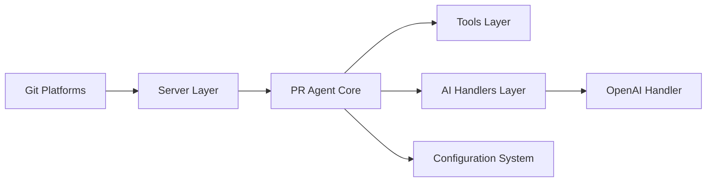

# Codium-ai/pr-agent

> Agent open source de revue de pull requests par LLM, pour équipes sur GitHub, GitLab, Bitbucket ou Azure DevOps.

## Le problème
Les revues de PR sont lentes ; décrire, relire et suggérer des améliorations à la main mobilise les relecteurs.

## Ce que ça fait vraiment
Outils `/describe`, `/review`, `/improve`, `/ask` et `/similar_issue`, chacun avec un seul appel LLM (~30 s). Déployable en GitHub Action, CLI, Docker, webhook auto-hébergé. Compression de PR pour les gros diffs, prompts configurables en JSON, tout modèle via LiteLLM (OpenAI, Claude, Gemini, Ollama…). Projet communautaire hérité de Qodo, distinct de l'offre Qodo. `/help_docs` est désactivé depuis v0.36.1.

## Comment c'est branché


## Essayer
```bash
pip install pr-agent
export OPENAI_KEY=your_key_here
pr-agent --pr_url https://github.com/owner/repo/pull/123 review
```

## Coût et pièges
Chaque appel LLM est facturé à ta clé (OpenAI ou autre). Les images Docker sont sous `pragent/pr-agent` depuis 0.34.2. Un problème d'exposition d'identifiants (#2445) a fait désactiver `/help_docs`. Licence non renseignée au catalogue.

## Ce que ce n'est pas
Pas l'offre Qodo : le README précise la distinction. Ne remplace pas une relecture humaine.

## Alternatives
Le README cite l'offre Qodo, avec version gratuite pour l'open source.

## Pour toi
Adopter à l'essai si tu veux un relecteur de PR automatique et auto-hébergé ; vérifier la licence avant l'intégrer en entreprise.
