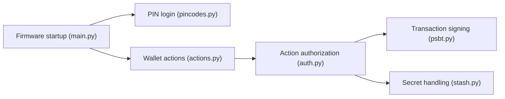

# Coldcard/firmware

> Micrologiciel du portefeuille matériel Bitcoin Coldcard, avec simulateur et builds reproductibles.

## Le problème
Un portefeuille matériel doit pouvoir être audité : le binaire sur l'appareil doit correspondre au code source.

## Ce que ça fait vraiment
Code MicroPython/C du portefeuille : PIN, secrets, signature PSBT, multisig, sauvegardes, USB, avec simulateur de bureau. Builds reproductibles via Docker. Un avis de sécurité en tête signale qu'une mauvaise entropie a affecté les secrets générés de 2021 à juillet 2026, avec des versions minimales de confiance listées.

## Comment c'est branché


## Essayer
```bash
git clone --recursive https://github.com/Coldcard/firmware.git
cd firmware/stm32
make -f MK4-Makefile repro
cd unix && ./simulator.py
```

## Coût et pièges
Docker et make pour la reproduction ; compilation longue (sous-modules). Chemin sans espace obligatoire. Licence présente mais non identifiée par GitHub : à vérifier.

## Ce que ce n'est pas
Pas un logiciel à installer pour utiliser le portefeuille. L'avis de sécurité impose de régénérer les secrets créés avec les versions antérieures aux niveaux indiqués.

## Alternatives
Aucune alternative nommée dans le README.

## Pour toi
À surveiller seulement si tu as un Coldcard (lire l'avis de sécurité d'abord) ; hors périmètre data/IA.

