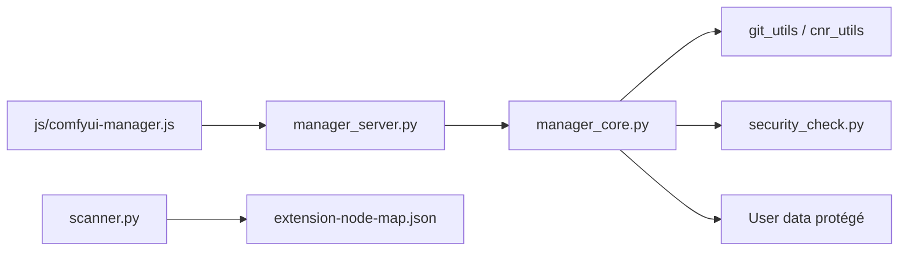

# Comfy-Org/ComfyUI-Manager

> Extension de ComfyUI pour installer, mettre à jour, désactiver et retirer nœuds personnalisés et modèles.

## Le problème
Les nœuds personnalisés de ComfyUI s'installent à la main, avec des conflits de dépendances difficiles à suivre.

## Ce que ça fait vraiment
Un menu dans ComfyUI qui liste les nœuds et modèles (base locale ou canal distant), les installe par Git ou par le registre `registry.comfy.org`, gère snapshots restaurables, composants partageables, réparation de nœuds anciens et partage de workflows. Options : `uv` à la place de pip, listes de blocage de paquets, niveaux de sécurité, mode réseau public/privé/hors ligne. Un `cm-cli` permet un usage sans interface.

## Comment c'est branché


## Essayer
```bash
cd ComfyUI/custom_nodes
git clone https://github.com/ltdrdata/ComfyUI-Manager comfyui-manager
pip install comfy-cli
comfy install
```

## Coût et pièges
Installer un nœud exécute du code tiers : régler `security_level`. L'installation par URL Git ou pip est désactivée par défaut et limitée au bouclage local. Le dossier doit être exactement `custom_nodes/comfyui-manager`. 477 issues ouvertes. Licence GPL-3.0.

## Ce que ce n'est pas
Il ne garantit pas le bon fonctionnement des nœuds installés (mise en garde du README). Ce n'est pas ComfyUI lui-même.

## Alternatives
`comfy-cli` : recommandé par le README pour installer ComfyUI et le Manager d'un coup.

## Pour toi
À adopter si tu utilises ComfyUI en génération d'images : c'est le point d'entrée de fait pour gérer les nœuds, avec les garde-fous de sécurité à activer.

