# Comfy-Org/ComfyUI

> **A local node graph for driving image, video, audio and 3D generation.**

## The problem

Without it, every generative model comes with its own script or its own interface, and chaining
text→image→edit→upscale→video means writing throwaway glue code, reloading weights by hand and
managing VRAM yourself on a machine that is always slightly too small.

## What it actually does

- A graph interface where each node is one step (checkpoint loading, prompt encoding, sampling,
  VAE, masking, saving) and each wire carries tensors; workflows are built and replayed without
  writing code.
- Asynchronous local execution with a queue, partial graph re-execution (only the parts that
  changed run again) and VRAM/RAM management with model offloading and quantized model support.
- Separate loading of the pieces: full checkpoints or standalone diffusion models, VAEs, text
  encoders, LoRAs, ControlNets, adapters and upscalers.
- Built-in tooling: inpainting, outpainting, reference conditioning, masks and compositing,
  model merging, upscaling, frame interpolation, segmentation, depth estimation.
- Workflows save as JSON and can be recovered — seeds included — by dragging a generated PNG
  onto the page; a local API and App Mode expose the whole thing to an application.
- The core runs offline: it downloads nothing unless asked, and `--disable-api-nodes` turns off
  the optional paid API nodes to force everything local.

## How it is wired

The server receives the workflow, the queue holds it, the execution engine resolves nodes,
generation nodes call the models, and outputs go back to storage and to the server. Partner
nodes (dotted) leave the machine for third-party APIs.

```mermaid
flowchart TD

subgraph group_interface["Interface &amp; API"]
  node_prompt_server["Prompt Server<br/>[server.py]"]
  node_internal_routes["Internal Routes<br/>[internal_routes.py]"]
  node_user_manager["User Data<br/>[user_manager.py]"]
end

subgraph group_execution["Workflow Execution"]
  node_prompt_queue["Prompt Queue<br/>[jobs.py]"]
  node_main_runtime["Runtime Loop<br/>[main.py]"]
  node_graph_engine["Graph Executor<br/>[execution.py]"]
  node_node_registry["Node Registry<br/>[nodes.py]"]
  node_subgraphs["Subgraphs"]
  node_node_replacements["Node Replacements"]
end

subgraph group_models["Models &amp; Generation"]
  node_model_manager["Model Manager<br/>[model_manager.py]"]
  node_model_stack["Model Stack"]
  node_diffusion_models["Diffusion Models"]
  node_generation_nodes["Generation Nodes"]
end

subgraph group_platform["Platform Services"]
  node_storage_paths[("Media Storage<br/>[folder_paths.py]")]
  node_asset_database[("Asset Database<br/>[models.py]")]
  node_api_client["Partner API Client<br/>[client.py]"]
  node_openrouter_node["OpenRouter Nodes"]
end

node_user(("Creative User"))
node_openrouter_service["OpenRouter Service"]

node_user -->|"submits workflow"| node_prompt_server
node_prompt_server -->|"queues prompt"| node_prompt_queue
node_prompt_server -->|"serves user data"| node_user_manager
node_prompt_server -->|"exposes routes"| node_internal_routes
node_main_runtime -->|"consumes jobs"| node_prompt_queue
node_main_runtime -->|"executes prompt"| node_graph_engine
node_graph_engine -->|"resolves nodes"| node_node_registry
node_graph_engine -->|"loads subgraphs"| node_subgraphs
node_graph_engine -->|"applies replacements"| node_node_replacements
node_node_registry -->|"registers nodes"| node_generation_nodes
node_generation_nodes -->|"loads models"| node_model_manager
node_model_manager -->|"scans folders"| node_storage_paths
node_model_stack -->|"runs models"| node_diffusion_models
node_generation_nodes -->|"invokes generation"| node_model_stack
node_prompt_server -->|"reads media"| node_storage_paths
node_generation_nodes -->|"writes outputs"| node_storage_paths
node_prompt_server -->|"tracks assets"| node_asset_database
node_graph_engine -->|"reports results"| node_prompt_server
node_openrouter_node -.->|"submits request"| node_api_client
node_api_client -.->|"calls provider"| node_openrouter_service

click node_prompt_server "https://github.com/comfy-org/comfyui/blob/master/server.py"
click node_internal_routes "https://github.com/comfy-org/comfyui/blob/master/api_server/routes/internal/internal_routes.py"
click node_user_manager "https://github.com/comfy-org/comfyui/blob/master/app/user_manager.py"
click node_prompt_queue "https://github.com/comfy-org/comfyui/blob/master/comfy_execution/jobs.py"
click node_main_runtime "https://github.com/comfy-org/comfyui/blob/master/main.py"
click node_graph_engine "https://github.com/comfy-org/comfyui/blob/master/execution.py"
click node_node_registry "https://github.com/comfy-org/comfyui/blob/master/nodes.py"
click node_subgraphs "https://github.com/comfy-org/comfyui/blob/master/app/subgraph_manager.py"
click node_node_replacements "https://github.com/comfy-org/comfyui/blob/master/app/node_replace_manager.py"
click node_model_manager "https://github.com/comfy-org/comfyui/blob/master/app/model_manager.py"
click node_model_stack "https://github.com/comfy-org/comfyui/blob/master/comfy/model_management.py"
click node_diffusion_models "https://github.com/comfy-org/comfyui/tree/master/comfy/ldm"
click node_generation_nodes "https://github.com/comfy-org/comfyui/tree/master/comfy_extras"
click node_storage_paths "https://github.com/comfy-org/comfyui/blob/master/folder_paths.py"
click node_asset_database "https://github.com/comfy-org/comfyui/blob/master/app/database/models.py"
click node_api_client "https://github.com/comfy-org/comfyui/blob/master/comfy_api_nodes/util/client.py"
click node_openrouter_node "https://github.com/comfy-org/comfyui/blob/master/comfy_api_nodes/nodes_openrouter.py"

classDef toneNeutral fill:#f8fafc,stroke:#334155,stroke-width:1.5px,color:#0f172a
classDef toneBlue fill:#dbeafe,stroke:#2563eb,stroke-width:1.5px,color:#172554
classDef toneAmber fill:#fef3c7,stroke:#d97706,stroke-width:1.5px,color:#78350f
classDef toneMint fill:#dcfce7,stroke:#16a34a,stroke-width:1.5px,color:#14532d
classDef toneRose fill:#ffe4e6,stroke:#e11d48,stroke-width:1.5px,color:#881337
classDef toneIndigo fill:#e0e7ff,stroke:#4f46e5,stroke-width:1.5px,color:#312e81
classDef toneTeal fill:#ccfbf1,stroke:#0f766e,stroke-width:1.5px,color:#134e4a
class node_prompt_server,node_internal_routes,node_user_manager,node_user toneBlue
class node_prompt_queue,node_main_runtime,node_graph_engine,node_node_registry,node_subgraphs,node_node_replacements toneAmber
class node_model_manager,node_model_stack,node_diffusion_models,node_generation_nodes,node_openrouter_service toneMint
class node_storage_paths,node_asset_database,node_api_client,node_openrouter_node toneRose
```



## Trying it

```bash
# installation assistée via comfy-cli
pip install comfy-cli
comfy install

# ou installation manuelle : git clone du dépôt, puis PyTorch selon le GPU
pip install torch torchvision torchaudio --extra-index-url https://download.pytorch.org/whl/cu130
pip install -r requirements.txt

# lancer
python main.py

# gestionnaire de nodes personnalisés (optionnel)
pip install -r manager_requirements.txt
python main.py --enable-manager

# aperçus haute qualité (optionnel)
python main.py --preview-method taesd
```

## Cost and gotchas

The core is free and local, but the hardware is on you: an NVIDIA, AMD (ROCm), Intel (xpu),
Apple Silicon or Ascend GPU with enough VRAM for the target model — the README gives no figures
and points to a wiki page on which GPU to buy. Python 3.13 is the best-supported ground (3.14
breaks some custom nodes), torch 2.7 is the floor, and cu130 or newer is required on NVIDIA 20
series and above. Weights are downloaded and placed by hand into `models/checkpoints`,
`models/vae`, `models/embeddings`. Two optional costs: partner API nodes (Nano Banana, Seedance,
Hunyuan3D) are paid, and Comfy Cloud is the paid hosted version. The README also warns that
commits outside stable release tags "may be very unstable and break many custom nodes".

## What it is not

It is not a turnkey image generator: it ships no models, only the machinery to run them —
everything depends on the weights you fetch yourself and the graph you build. It is not a
service either: no hosting, no multi-tenancy, no scaling — the cloud version is a separate paid
product. And the frontend no longer lives here: it sits in ComfyUI_frontend and is merged into
the core only every two weeks, which delays interface fixes.

## Alternatives

- **AUTOMATIC1111/stable-diffusion-webui**: a form-based interface rather than a graph — faster
  for plain text-to-image, weaker as soon as you want a reproducible pipeline.
- **Comfy Cloud** (named in the README): the same thing hosted and paid, for those without a GPU.

ray-project/ray, vllm-project/vllm and unslothai/unsloth are not comparable: they cover
distributed compute, LLM serving and fine-tuning respectively, not visual generation workflows.

## For you

Adopt it the moment a project touches image or video generation: it is the standard bench for
trying a diffusion model, and the workflow JSON plus local API make it a callable building block
in a pipeline. Skip it if your ground is text or tabular data — it brings nothing there.
