# Comfy-Org/ComfyUI

> **Un graphe de nœuds local pour piloter la génération d'images, de vidéos, d'audio et de 3D.**

## Le problème

Sans lui, chaque modèle génératif s'utilise par son propre script ou sa propre interface, et
enchaîner texte→image→retouche→upscale→vidéo revient à écrire du code de colle jetable, à
recharger les poids à la main et à gérer soi-même la VRAM d'une machine trop petite.

## Ce que ça fait vraiment

- Une interface de graphe où chaque nœud est une étape (chargement de checkpoint, encodage du
  prompt, échantillonnage, VAE, masque, sauvegarde) et les liens le flux de tenseurs ; le
  workflow se construit et se rejoue sans écrire de code.
- Une exécution locale asynchrone avec file d'attente, réexécution partielle du graphe
  (seules les parties modifiées tournent à nouveau) et gestion de la VRAM/RAM avec déchargement
  de modèles et support des modèles quantifiés.
- Un chargement séparé des briques : checkpoints complets ou modèles de diffusion, VAE,
  encodeurs de texte, LoRA, ControlNets, adaptateurs, upscalers.
- Des outils intégrés : inpainting, outpainting, conditionnement par référence, masques et
  compositing, fusion de modèles, upscaling, interpolation d'images, segmentation, profondeur.
- Les workflows s'enregistrent en JSON et se récupèrent — graines comprises — en glissant un
  PNG généré sur la page ; une API locale et le mode App exposent le tout à une application.
- Le cœur fonctionne hors ligne : il ne télécharge rien sans demande, et `--disable-api-nodes`
  coupe les nœuds d'API payants pour forcer le tout-local.

## Comment c'est branché

Le serveur reçoit le workflow, la file le met en attente, le moteur d'exécution résout les
nœuds, les nœuds de génération appellent les modèles, et les sorties repartent vers le stockage
et le serveur. Les nœuds partenaires (pointillés) sortent de la machine vers des API tierces.

```mermaid
flowchart TD

subgraph group_interface["Interface &amp; API"]
  node_prompt_server["Prompt Server<br/>[server.py]"]
  node_internal_routes["Internal Routes<br/>[internal_routes.py]"]
  node_user_manager["User Data<br/>[user_manager.py]"]
end

subgraph group_execution["Workflow Execution"]
  node_prompt_queue["Prompt Queue<br/>[jobs.py]"]
  node_main_runtime["Runtime Loop<br/>[main.py]"]
  node_graph_engine["Graph Executor<br/>[execution.py]"]
  node_node_registry["Node Registry<br/>[nodes.py]"]
  node_subgraphs["Subgraphs"]
  node_node_replacements["Node Replacements"]
end

subgraph group_models["Models &amp; Generation"]
  node_model_manager["Model Manager<br/>[model_manager.py]"]
  node_model_stack["Model Stack"]
  node_diffusion_models["Diffusion Models"]
  node_generation_nodes["Generation Nodes"]
end

subgraph group_platform["Platform Services"]
  node_storage_paths[("Media Storage<br/>[folder_paths.py]")]
  node_asset_database[("Asset Database<br/>[models.py]")]
  node_api_client["Partner API Client<br/>[client.py]"]
  node_openrouter_node["OpenRouter Nodes"]
end

node_user(("Creative User"))
node_openrouter_service["OpenRouter Service"]

node_user -->|"submits workflow"| node_prompt_server
node_prompt_server -->|"queues prompt"| node_prompt_queue
node_prompt_server -->|"serves user data"| node_user_manager
node_prompt_server -->|"exposes routes"| node_internal_routes
node_main_runtime -->|"consumes jobs"| node_prompt_queue
node_main_runtime -->|"executes prompt"| node_graph_engine
node_graph_engine -->|"resolves nodes"| node_node_registry
node_graph_engine -->|"loads subgraphs"| node_subgraphs
node_graph_engine -->|"applies replacements"| node_node_replacements
node_node_registry -->|"registers nodes"| node_generation_nodes
node_generation_nodes -->|"loads models"| node_model_manager
node_model_manager -->|"scans folders"| node_storage_paths
node_model_stack -->|"runs models"| node_diffusion_models
node_generation_nodes -->|"invokes generation"| node_model_stack
node_prompt_server -->|"reads media"| node_storage_paths
node_generation_nodes -->|"writes outputs"| node_storage_paths
node_prompt_server -->|"tracks assets"| node_asset_database
node_graph_engine -->|"reports results"| node_prompt_server
node_openrouter_node -.->|"submits request"| node_api_client
node_api_client -.->|"calls provider"| node_openrouter_service

click node_prompt_server "https://github.com/comfy-org/comfyui/blob/master/server.py"
click node_internal_routes "https://github.com/comfy-org/comfyui/blob/master/api_server/routes/internal/internal_routes.py"
click node_user_manager "https://github.com/comfy-org/comfyui/blob/master/app/user_manager.py"
click node_prompt_queue "https://github.com/comfy-org/comfyui/blob/master/comfy_execution/jobs.py"
click node_main_runtime "https://github.com/comfy-org/comfyui/blob/master/main.py"
click node_graph_engine "https://github.com/comfy-org/comfyui/blob/master/execution.py"
click node_node_registry "https://github.com/comfy-org/comfyui/blob/master/nodes.py"
click node_subgraphs "https://github.com/comfy-org/comfyui/blob/master/app/subgraph_manager.py"
click node_node_replacements "https://github.com/comfy-org/comfyui/blob/master/app/node_replace_manager.py"
click node_model_manager "https://github.com/comfy-org/comfyui/blob/master/app/model_manager.py"
click node_model_stack "https://github.com/comfy-org/comfyui/blob/master/comfy/model_management.py"
click node_diffusion_models "https://github.com/comfy-org/comfyui/tree/master/comfy/ldm"
click node_generation_nodes "https://github.com/comfy-org/comfyui/tree/master/comfy_extras"
click node_storage_paths "https://github.com/comfy-org/comfyui/blob/master/folder_paths.py"
click node_asset_database "https://github.com/comfy-org/comfyui/blob/master/app/database/models.py"
click node_api_client "https://github.com/comfy-org/comfyui/blob/master/comfy_api_nodes/util/client.py"
click node_openrouter_node "https://github.com/comfy-org/comfyui/blob/master/comfy_api_nodes/nodes_openrouter.py"

classDef toneNeutral fill:#f8fafc,stroke:#334155,stroke-width:1.5px,color:#0f172a
classDef toneBlue fill:#dbeafe,stroke:#2563eb,stroke-width:1.5px,color:#172554
classDef toneAmber fill:#fef3c7,stroke:#d97706,stroke-width:1.5px,color:#78350f
classDef toneMint fill:#dcfce7,stroke:#16a34a,stroke-width:1.5px,color:#14532d
classDef toneRose fill:#ffe4e6,stroke:#e11d48,stroke-width:1.5px,color:#881337
classDef toneIndigo fill:#e0e7ff,stroke:#4f46e5,stroke-width:1.5px,color:#312e81
classDef toneTeal fill:#ccfbf1,stroke:#0f766e,stroke-width:1.5px,color:#134e4a
class node_prompt_server,node_internal_routes,node_user_manager,node_user toneBlue
class node_prompt_queue,node_main_runtime,node_graph_engine,node_node_registry,node_subgraphs,node_node_replacements toneAmber
class node_model_manager,node_model_stack,node_diffusion_models,node_generation_nodes,node_openrouter_service toneMint
class node_storage_paths,node_asset_database,node_api_client,node_openrouter_node toneRose
```



## Essayer

```bash
# installation assistée via comfy-cli
pip install comfy-cli
comfy install

# ou installation manuelle : git clone du dépôt, puis PyTorch selon le GPU
pip install torch torchvision torchaudio --extra-index-url https://download.pytorch.org/whl/cu130
pip install -r requirements.txt

# lancer
python main.py

# gestionnaire de nodes personnalisés (optionnel)
pip install -r manager_requirements.txt
python main.py --enable-manager

# aperçus haute qualité (optionnel)
python main.py --preview-method taesd
```

## Coût et pièges

Le cœur est gratuit et local, mais le matériel est à ta charge : un GPU NVIDIA, AMD (ROCm),
Intel (xpu), Apple Silicon ou Ascend, avec assez de VRAM pour le modèle visé — le README ne
chiffre pas les besoins et renvoie à une page wiki « quel GPU acheter ». Python 3.13 est le
terrain le mieux supporté (3.14 casse certains nœuds personnalisés), torch 2.7 est le plancher
et cu130 ou plus est exigé sur les NVIDIA série 20 et au-dessus. Les poids se téléchargent et
se rangent à la main dans `models/checkpoints`, `models/vae`, `models/embeddings`. Deux coûts
optionnels : les nœuds d'API partenaires (Nano Banana, Seedance, Hunyuan3D) sont payants, et
Comfy Cloud est la version hébergée payante. Le README prévient aussi que les commits hors
tags stables « peuvent être très instables et casser beaucoup de nœuds personnalisés ».

## Ce que ce n'est pas

Ce n'est pas un générateur d'images clé en main : il n'embarque aucun modèle, seulement de quoi
les exécuter — tout se joue dans les poids qu'on télécharge soi-même et dans le graphe qu'on
construit. Ce n'est pas non plus un service : pas d'hébergement, pas de multi-utilisateur, pas
de mise à l'échelle — la version cloud est un produit séparé et payant. Et le frontend n'est
plus ici : il vit dans ComfyUI_frontend et n'est fusionné dans le cœur que toutes les deux
semaines, ce qui décale les corrections d'interface.

## Alternatives

- **AUTOMATIC1111/stable-diffusion-webui** : interface à formulaires plutôt qu'à graphe — plus
  rapide pour un simple texte→image, moins adapté dès qu'on veut un pipeline reproductible.
- **Comfy Cloud** (cité dans le README) : la même chose hébergée et payante, pour qui n'a pas
  le GPU.

ray-project/ray, vllm-project/vllm et unslothai/unsloth ne sont pas comparables : ils servent
respectivement le calcul distribué, l'inférence de LLM et le fine-tuning, pas la construction
de workflows de génération visuelle.

## Pour toi

À adopter dès qu'un projet touche à la génération d'images ou de vidéos : c'est le banc d'essai
standard pour tester un modèle de diffusion, et le JSON de workflow plus l'API locale en font
une brique appelable depuis un pipeline. À ignorer si ton terrain est le texte ou la donnée
tabulaire — il n'y apporte rien.
