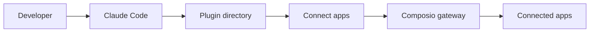

# ComposioHQ/awesome-claude-plugins

> Liste de plugins Claude Code par catégorie, avec un plugin maison connectant l'agent à 1000+ applications.

## Le problème
Trouver des plugins Claude Code utiles parmi un écosystème dispersé.

## Ce que ça fait vraiment
Un catalogue classé (intégrations, git, qualité, DevOps, sécurité, productivité). Certains plugins sont embarqués (audit-project, perf, ship, security-guidance, skill-bus). Chargement avec `claude --plugin-dir`.

## Comment c'est branché


## Essayer
```bash
git clone https://github.com/composiohq/awesome-claude-plugins.git
cd awesome-claude-plugins
claude --plugin-dir ./connect-apps
```

## Coût et pièges
`connect-apps` demande une clé Composio. Beaucoup de plugins listés sont externes et non vérifiés ici.

## Ce que ce n'est pas
Pas un ensemble audité : c'est une liste avec un plugin de son éditeur mis en avant. Le README dit « production-ready » ; je ne le reprends pas.

## Alternatives
Le README renvoie à ComposioHQ/awesome-claude-skills pour d'autres skills.

## Pour toi
À surveiller : sert de répertoire pour repérer des plugins (kaggle-skill, context-mode), à lire avant d'installer.
