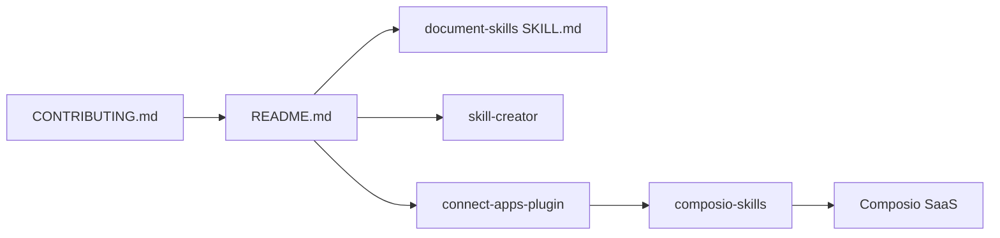

# ComposioHQ/awesome-claude-skills

> Liste de plus de mille skills et plugins pour Claude et autres agents, tenue par Composio.

## Le problème
Les skills pour agents se multiplient sans index : difficile de savoir ce qui existe déjà avant d'en écrire une.

## Ce que ça fait vraiment
Le `README.md` classe des skills par domaine (documents, code, données, marketing, écriture, sécurité…), avec une ligne et souvent l'auteur.
Le dépôt embarque aussi des packs : `document-skills` (docx, pdf, pptx, xlsx avec schémas OOXML), skills créatives (canvas-design, slack-gif-creator), outils d'écriture de skills (skill-creator, mcp-builder).
Le plugin `connect-apps-plugin` relie Claude à plus de 1 000 applis via la passerelle MCP hébergée de Composio.

## Comment c'est branché


## Essayer
```bash
claude --plugin-dir ./connect-apps-plugin
# puis, dans Claude : /connect-apps:setup
exit
claude
```

## Coût et pièges
La partie actions exige une clé Composio (gratuite sur dashboard.composio.dev) : tes appels passent par leur service. Aucune licence au niveau du dépôt ; licences propres à chaque pack.

## Ce que ce n'est pas
Pas une liste neutre : elle sert aussi de vitrine à la passerelle Composio. Les skills listées ne sont pas auditées, et beaucoup viennent de tiers.

## Alternatives
Aucune alternative nommée dans le README.

## Pour toi
À surveiller comme annuaire ; lis chaque skill avant de l'installer, et évite de passer par le SaaS sans besoin réel.
