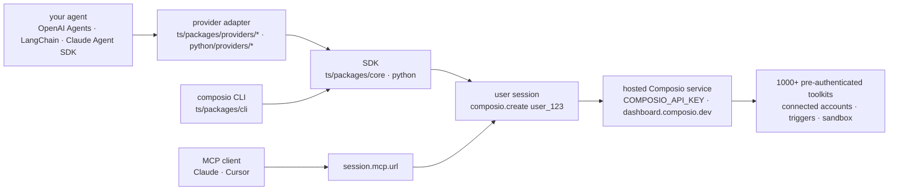

# ComposioHQ/composio

> **The client SDK for a hosted service that hands an agent pre-authenticated SaaS tools, per end user.**

## The problem

Wiring an agent to Gmail, Slack or Notion means the same chore every time: register an OAuth app,
store and refresh a token per end user, write the schema for each call, then start over for the
next app. And loading hundreds of tool definitions into the model's context costs money before
the first call is made.

## What it actually does

This repo is a monorepo of **client SDKs**: the service that holds the tools and the
authentication lives on Composio's infrastructure, not here. The SDK opens a *session* bound to a
user id (`composio.create("user_123")`), pulls a tool list from it, and hands that list to your
agent framework as is.

The README claims 1000+ pre-authenticated toolkits, per-user sessions, triggers and a sandbox. By
default a session does not ship thousands of tools but *meta tools* that discover, authenticate
and execute a tool at runtime — that is the answer to the context cost. `session.session_id` can
be stored and replayed with `composio.use()` across turns.

Two SDKs are published, TypeScript (`@composio/core`, plus `@composio/slim` without the packaged
source) and Python (`composio`), backed by some twenty **provider adapters** that translate tools
into the native format of OpenAI Agents, Anthropic, Claude Agent SDK, Vercel AI SDK, LangChain,
LangGraph, LlamaIndex, Mastra, CrewAI, AutoGen and others. A CLI (`composio search`, `execute`,
`link`, `run`) exposes the same surface to the shell and to coding agents. Every session also
publishes a hosted MCP endpoint (`mcp: true`, then `session.mcp.url`) for clients that prefer
that protocol over the adapters.

## How it is wired



No code-derived diagram exists for this repo: this one is rebuilt from the README alone, reusing
the paths it lists. The bottom node is the point — everything goes through the hosted service,
and the repo stops at the session.

## Trying it

```bash
npm install @composio/core @composio/openai-agents @openai/agents
```

```typescript
import { Composio } from "@composio/core";
import { OpenAIAgentsProvider } from "@composio/openai-agents";
import { Agent, run } from "@openai/agents";

const composio = new Composio({ provider: new OpenAIAgentsProvider() });

// Each session is scoped to one of your users
const session = await composio.create("user_123");
const tools = await session.tools();
```

On the Python side, and for the CLI:

```bash
pip install composio composio-openai-agents openai-agents

curl -fsSL https://composio.dev/install | sh
composio login
```

The README says to grab a `COMPOSIO_API_KEY` from `dashboard.composio.dev/settings` first. For
the repo itself: `mise install`, `pnpm install`, `pnpm build`, `pnpm test`.

## Cost and gotchas

- **An API key and an account are required**; the README opens on that. No local or offline mode
  is documented.
- **Pricing is not documented** in the README — no free tier, no quota, no per-call billing.
  Check the dashboard before wiring anything.
- **Service dependency**: the OAuth tokens of *your* end users are held by the service. The MIT
  licence on this repo does not give you that half back.
- **Versions**: the TypeScript SDK is tested against Node 22+, the Python SDK supports Python
  3.10+.
- **`curl | sh` install** for the CLI, which edits your shell `PATH`; the README points to
  `INSTALL.md` and `COMPOSIO_INSTALL_SHELL=none` to avoid that write.
- **`@composio/core` packages its source and docs** so coding agents can inspect it;
  `@composio/slim` gives the same API in a smaller install.
- The **Pi** provider is flagged experimental and ships from `@composio/experimental`.

## What it is not

- **Not the product, its client.** The 1000+ tool catalogue, the authentication and the sandbox
  run on Composio's infrastructure; cloning this repo does not give you them. MIT covers the
  SDKs, not the service.
- **Not an agent framework**: there is no reasoning loop and no orchestration here. The agent
  stays yours (OpenAI Agents, LangChain, Claude Agent SDK); Composio only supplies its tools.
- **Not a self-hosted MCP server**: the MCP endpoint is the service's own, on a session URL, not
  a binary you run.

## Alternatives

| | When to prefer it |
|---|---|
| **aipotheosis-labs/aci** | Same space, authenticated tools for agents. Compare on how much can be self-hosted: Composio assumes a remote service, and that is the deciding criterion. |
| **Klavis-AI/klavis** | Same space on the MCP side. Worth a look if your integration goes through MCP servers rather than agent-framework adapters. |
| **IBM/mcp-context-forge** | An MCP gateway, for teams that want to own their tool control plane instead of consuming a hosted catalogue. |

None of these is named in Composio's README: they come from the catalogue's neighbours and should
be checked yourself. `deepset-ai/haystack`, the fourth neighbour, is not comparable (a RAG
framework).

## For you

Worth watching if the job is a production agent acting on behalf of end users: multi-user OAuth
token handling is a real cost, and the meta tools that avoid loading a thousand schemas into
context are the good idea here. Watch rather than adopt while pricing is unknown and while
depending on a third party for your customers' credentials is unsettled. For data or MLOps work
outside a product, skip it.
