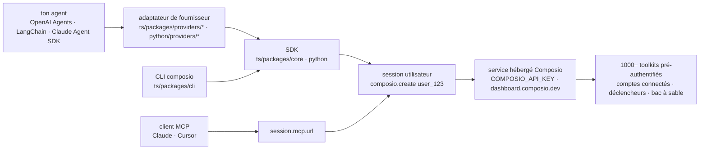

# ComposioHQ/composio

> **Le SDK client d'un service hébergé qui donne à un agent des outils SaaS déjà authentifiés, par utilisateur.**

## Le problème

Brancher un agent sur Gmail, Slack ou Notion demande à chaque fois le même travail ingrat :
enregistrer une application OAuth, stocker et rafraîchir un jeton par utilisateur final, écrire
le schéma de chaque appel, puis recommencer pour l'application suivante. Et charger des centaines
de définitions d'outils dans le contexte du modèle coûte cher avant même le premier appel.

## Ce que ça fait vraiment

Ce dépôt est un monorepo de **SDK clients** : le service qui détient les outils et les
authentifications, lui, est hébergé chez Composio et n'est pas dans ce dépôt. Le SDK ouvre une
*session* rattachée à un identifiant d'utilisateur (`composio.create("user_123")`), en tire une
liste d'outils, et la passe telle quelle au cadre d'agent.

Le README annonce « 1000+ pre-authenticated toolkits », des sessions par utilisateur, des
déclencheurs et un bac à sable. Par défaut, une session ne livre pas les milliers d'outils mais
des *méta-outils* qui découvrent, authentifient et exécutent un outil au moment voulu — c'est la
réponse au coût de contexte. `session.session_id` se stocke et se rejoue avec `composio.use()`
d'un tour à l'autre.

Deux SDK sont publiés, TypeScript (`@composio/core`, plus `@composio/slim` sans les sources
embarquées) et Python (`composio`), doublés d'une vingtaine d'**adaptateurs de fournisseur** qui
traduisent les outils au format natif d'OpenAI Agents, Anthropic, Claude Agent SDK, Vercel AI
SDK, LangChain, LangGraph, LlamaIndex, Mastra, CrewAI, AutoGen et d'autres. Une CLI (`composio
search`, `execute`, `link`, `run`) expose la même surface au shell et aux agents de code. Chaque
session publie aussi un point d'accès MCP hébergé (`mcp: true`, puis `session.mcp.url`) pour les
clients qui préfèrent ce protocole aux adaptateurs.

## Comment c'est branché



Aucun diagramme tiré du code n'existe pour ce dépôt : ce schéma est reconstruit depuis le seul
README, en reprenant les chemins qu'il cite. L'important est le nœud du bas : tout passe par le
service hébergé, le dépôt s'arrête à la session.

## Essayer

```bash
npm install @composio/core @composio/openai-agents @openai/agents
```

```typescript
import { Composio } from "@composio/core";
import { OpenAIAgentsProvider } from "@composio/openai-agents";
import { Agent, run } from "@openai/agents";

const composio = new Composio({ provider: new OpenAIAgentsProvider() });

// Each session is scoped to one of your users
const session = await composio.create("user_123");
const tools = await session.tools();
```

Côté Python, et pour la CLI :

```bash
pip install composio composio-openai-agents openai-agents

curl -fsSL https://composio.dev/install | sh
composio login
```

Le README précise qu'il faut d'abord récupérer un `COMPOSIO_API_KEY` sur
`dashboard.composio.dev/settings`. Pour le dépôt lui-même : `mise install`, `pnpm install`,
`pnpm build`, `pnpm test`.

## Coût et pièges

- **Clé d'API obligatoire et compte à créer** : le README ouvre là-dessus. Aucun mode local, aucun
  mode hors ligne n'est documenté.
- **Le prix n'est pas documenté** dans le README. Ni palier gratuit, ni quota, ni facturation à
  l'appel : c'est à vérifier sur le tableau de bord avant de câbler quoi que ce soit.
- **Dépendance de service** : les jetons OAuth de *tes* utilisateurs finaux sont détenus par le
  service. Le dépôt, MIT, ne te rend pas cette moitié-là.
- **Versions** : SDK TypeScript testé sur Node 22+, SDK Python sur Python 3.10+.
- **Installation par `curl | sh`** pour la CLI, qui modifie le `PATH` du shell ; le README renvoie
  à `INSTALL.md` et à `COMPOSIO_INSTALL_SHELL=none` pour éviter cette écriture.
- **`@composio/core` embarque ses sources et sa doc** pour rester lisible par un agent de code ;
  `@composio/slim` donne la même API en plus léger.
- Le fournisseur **Pi** est annoncé comme expérimental et livré depuis `@composio/experimental`.

## Ce que ce n'est pas

- **Ce n'est pas le produit, c'est son client.** Le catalogue de 1000+ outils, l'authentification
  et le bac à sable vivent sur l'infrastructure de Composio ; cloner ce dépôt ne les donne pas.
  La licence MIT porte sur les SDK, pas sur le service.
- **Ce n'est pas un cadre d'agent** : il n'y a ni boucle de raisonnement ni orchestration ici.
  L'agent reste le tien (OpenAI Agents, LangChain, Claude Agent SDK) ; Composio ne fournit que
  ses outils.
- **Ce n'est pas un serveur MCP qu'on héberge** : le point d'accès MCP est celui du service, sur
  une URL de session, pas un binaire à faire tourner chez soi.

## Alternatives

| | Quand le préférer |
|---|---|
| **aipotheosis-labs/aci** | Même créneau, outils authentifiés pour agents. À comparer sur la part auto-hébergeable : Composio suppose un service distant, et c'est le critère qui tranche. |
| **Klavis-AI/klavis** | Même créneau côté MCP. À regarder si l'intégration passe par des serveurs MCP plutôt que par des adaptateurs de cadre d'agent. |
| **IBM/mcp-context-forge** | Passerelle MCP, adressée à qui veut tenir son propre plan de contrôle des outils plutôt que consommer un catalogue hébergé. |

Aucune n'est nommée dans le README de Composio : ce sont les voisins du catalogue, à vérifier
soi-même. `deepset-ai/haystack`, quatrième voisin, n'est pas comparable (cadre RAG).

## Pour toi

Intéressant si le sujet est un agent en production qui agit pour des utilisateurs finaux : la
gestion des jetons OAuth multi-utilisateurs est un vrai coût, et les méta-outils qui évitent de
charger mille schémas en contexte sont la bonne idée du lot. À surveiller plutôt qu'adopter tant
que le prix n'est pas connu et que la dépendance à un service tiers pour les identifiants de tes
clients n'est pas arbitrée. Pour un travail de data ou de MLOps hors produit, passe ton chemin.
