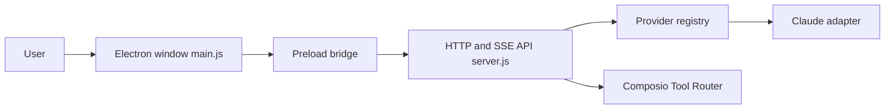

# ComposioHQ/open-claude-cowork

> Application de bureau Electron pour dialoguer avec Claude et 500+ applications via Composio.

## Le problème
Relier un agent à Gmail, Slack ou GitHub demande d'écrire les intégrations et l'authentification soi-même.

## Ce que ça fait vraiment
Une fenêtre Electron appelle un serveur Express, qui passe les messages au Claude Agent SDK ou à Opencode. Les outils viennent du Composio Tool Router (MCP), les réponses arrivent en SSE. Des skills se chargent depuis `.claude/skills/`.

## Comment c'est branché


## Essayer
```bash
git clone https://github.com/ComposioHQ/open-claude-cowork.git
cd open-claude-cowork
./setup.sh
cd server && npm start
npm start
```

## Coût et pièges
Clé Anthropic et clé Composio obligatoires. Les actions passent par le service Composio.

## Ce que ce n'est pas
Le README présente aussi « Secure Clawdbot », mais son code est absent de l'arbre analysé. Ce n'est pas un client hors ligne.

## Alternatives
Aucune alternative nommée dans le README.

## Pour toi
À ignorer : peu de valeur pour un profil data/MLOps, dépendance à Composio, et la moitié annoncée du dépôt manque.
