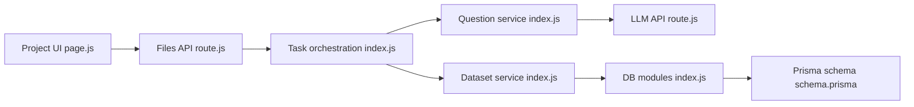

# ConardLi/easy-dataset

> Application locale qui transforme des documents en jeux de données QA pour fine-tuning, RAG et évaluation.

## Le problème
Produire un dataset de fine-tuning à partir de PDF métier demande découpage, génération de questions, nettoyage et export au bon format.

## Ce que ça fait vraiment
Ingestion PDF/DOCX/EPUB/Markdown, découpage (structure Markdown, récursif, taille fixe, code), arbre de labels.
Génération de questions, réponses et chaînes de raisonnement via LLM (compatibles OpenAI, Ollama, OpenRouter…), en tâches de fond.
Datasets QA simple, multi-tours, image ; jeux d'évaluation, juge LLM et test à l'aveugle.
Export Alpaca/ShareGPT en JSON/JSONL, config LLaMA Factory, envoi Hugging Face ; stockage Prisma local.

## Comment c'est branché


## Essayer
```bash
git clone https://github.com/ConardLi/easy-dataset.git
cd easy-dataset
npm install
npm run build
npm run start
docker-compose up -d
```

## Coût et pièges
Les appels LLM sont à ta charge (ou Ollama local). Base locale à monter en volume (`local-db`, `prisma`).

## Ce que ce n'est pas
Pas un outil d'entraînement : il prépare les données, l'entraînement se fait ailleurs (LLaMA Factory). Qualité dépendante du LLM choisi.

## Alternatives
Aucune alternative nommée dans le README.

## Pour toi
À adopter pour prototyper vite un dataset de fine-tuning ou d'éval RAG sur corpus métier, en vérifiant la licence avant usage commercial.
