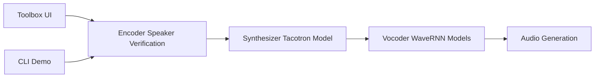

# CorentinJ/Real-Time-Voice-Cloning

> Implémentation SV2TTS de clonage vocal issue d'un mémoire de master, avec toolbox graphique.

## Le problème
Générer la voix d'un locuteur à partir de quelques secondes d'audio, sans réentraîner de modèle.

## Ce que ça fait vraiment
Trois étages : encodeur GE2E (empreinte vocale), synthétiseur Tacotron (texte → spectrogramme), vocodeur WaveRNN (spectrogramme → audio).
Toolbox GUI et démo CLI ; modèles pré-entraînés téléchargés automatiquement.
Datasets supportés, LibriSpeech train-clean-100 recommandé.
L'auteur écrit lui-même que le dépôt a vieilli et que la qualité est dépassée.

## Comment c'est branché


## Essayer
```bash
pip install -U uv
uv run --extra cuda demo_toolbox.py
uv run --extra cpu demo_cli.py
```

## Coût et pièges
FFmpeg requis ; GPU NVIDIA optionnel. Licence présente mais non identifiée par GitHub.

## Ce que ce n'est pas
Pas l'état de l'art : l'auteur recommande d'autres solutions. Le diagramme fourni est générique (explication, pas lecture du code).

## Alternatives
- Chatterbox : cité par l'auteur comme projet à jour de l'état de l'art 2025 (propriétaire du dépôt non précisé).

## Pour toi
Intérêt pédagogique sur SV2TTS uniquement ; ignorer pour un usage réel.
