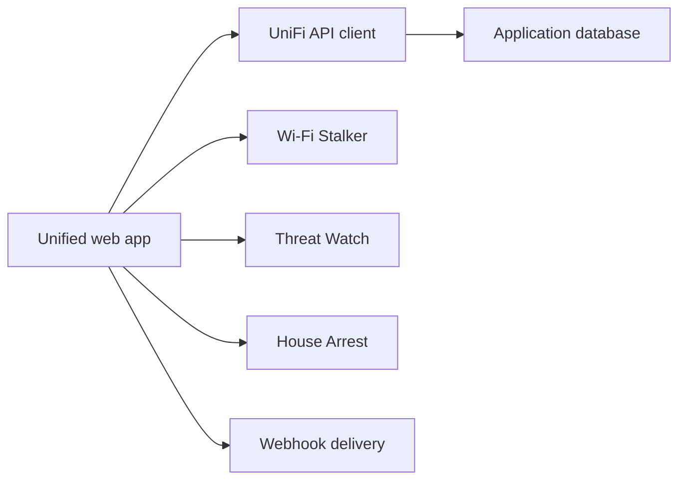

# Crosstalk-Solutions/unifi-toolkit

> Application web de supervision et de verrouillage de réseaux UniFi, pour administrateurs réseau.

## Le problème
Suivre les appareils, les menaces IDS/IPS et les règles de pare-feu sur un contrôleur UniFi demande de jongler entre plusieurs écrans.

## Ce que ça fait vraiment
Une appli FastAPI regroupe quatre outils : Wi-Fi Stalker (suivi d'appareils, itinérance, alertes webhook), Threat Watch (événements IDS/IPS), Network Pulse (tableau de bord temps réel) et House Arrest (verrouillage par pare-feu à zones, aperçu avant application). Les identifiants du contrôleur sont saisis dans l'interface et stockés chiffrés en base.

## Comment c'est branché


## Essayer
```bash
git clone https://github.com/Crosstalk-Solutions/unifi-toolkit.git
cd unifi-toolkit
./setup.sh
docker compose up -d
```

## Coût et pièges
Gratuit. Exige un contrôleur UniFi OS (les contrôleurs autonomes ne sont plus pris en charge depuis v1.11.0) et le pare-feu à zones (Network 9.0+). Le mode local n'a pas d'authentification.

## Ce que ce n'est pas
Pas un produit Ubiquiti (le README précise l'absence d'affiliation). Pas d'accès via le cloud unifi.ui.com. Sans lien avec la data ou l'IA.

## Alternatives
Aucune alternative nommée dans le README.

## Pour toi
Ignorer pour le travail data/MLOps : utile seulement si tu administres un réseau UniFi à la maison ou au bureau.
