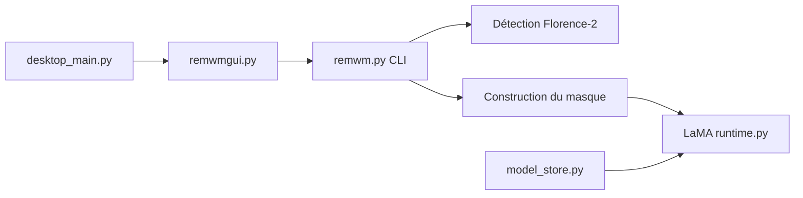

# D-Ogi/WatermarkRemover-AI

> Application qui détecte les filigranes avec Florence-2 et les efface par inpainting LaMA, sur images et vidéos.

## Le problème
Effacer un filigrane à la main image par image est long, surtout sur des vidéos.

## Ce que ça fait vraiment
Florence-2 localise le filigrane (invite « watermark » modifiable), un masque est construit puis LaMA remplit la zone. Gère images, vidéos (détection une image sur N, extension du masque pour les fondus, audio conservé via FFmpeg), traitement par lots, prévisualisation. GUI PyWebview ou CLI `remwm.py`. Les modèles sont préparés et vérifiés au premier lancement.

## Comment c'est branché


## Essayer
```bash
git clone https://github.com/D-Ogi/WatermarkRemover-AI.git
cd WatermarkRemover-AI
./setup.sh
./run.sh
python remwm.py input.png output_folder/
```

## Coût et pièges
Python 3.10+ (Linux/macOS), GPU CUDA pour accélérer, FFmpeg pour garder l'audio. Téléchargement de modèles au premier lancement.

## Ce que ce n'est pas
Pas un outil neutre : le README cible les vidéos générées par IA (Sora, Runway) et ne traite pas des droits d'auteur ni des conditions d'utilisation des œuvres concernées. La qualité sur filigranes complexes n'est pas chiffrée.

## Alternatives
Aucune alternative nommée dans le README.

## Pour toi
Ignorer : usage ponctuel de retouche média, sans intérêt pour un pipeline data/IA, et avec des questions de droits à trancher soi-même.

