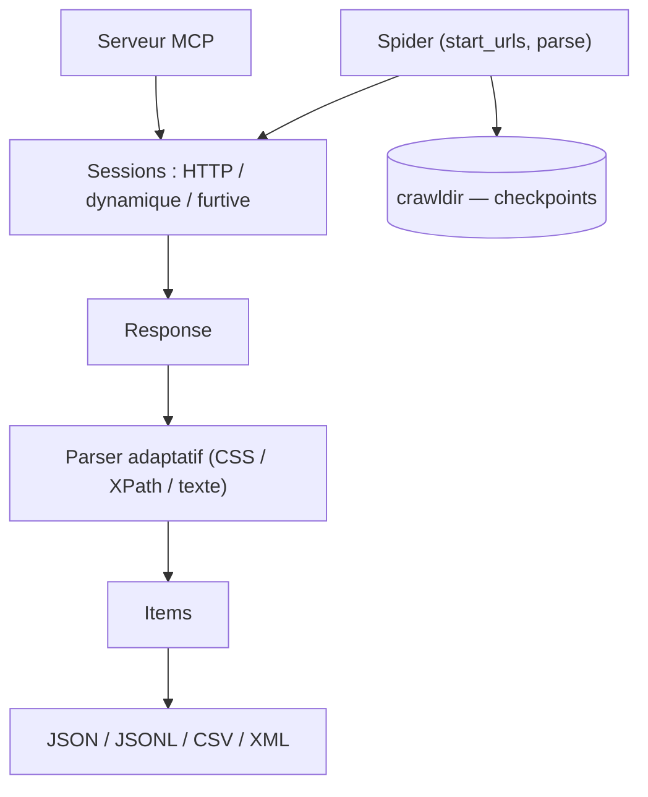

# D4Vinci/Scrapling

> Framework de scraping Python dont le parser retrouve les éléments après un changement de site.

## Le problème
Un sélecteur CSS casse dès que le site change de structure, et il faut réécrire le scraper.
Les protections anti-bot bloquent les requêtes avant même d'atteindre le contenu.

## Ce que ça fait vraiment
Avec `auto_save=True` puis `adaptive=True`, le parser relocalise les éléments par similarité après un changement.
Trois fetchers : HTTP avec empreinte TLS imitée, navigateur complet, mode furtif qui passe Cloudflare Turnstile.
Framework de spiders proche de Scrapy : concurrence, throttling par domaine, pause/reprise par checkpoint, streaming.
Templates prêts : `CrawlSpider`, `SitemapSpider`, `XMLFeedSpider`, `CSVFeedSpider`, `ShopifySpider`, `SiteToMarkdownSpider`.
Serveur MCP qui expose le scraping aux agents, avec nettoyage des injections de prompt avant lecture.

## Comment c'est branché


## Essayer
```bash
pip install "scrapling[fetchers]"
scrapling install
scrapling shell
scrapling extract get 'https://example.com' content.md
```

## Coût et pièges
Gratuit. Python 3.10+. Le `pip install scrapling` nu n'installe que le parser : importer un fetcher échoue.
Les extras (`fetchers`, `ai`, `rag`, `shell`, `all`) s'ajoutent, puis il faut encore `scrapling install` pour les navigateurs.

## Ce que ce n'est pas
Pas un contournement garanti : le README rappelle que l'usage doit respecter les CGU et robots.txt.
Les bancs de performance cités sont produits par le projet lui-même (`benchmarks.py`).
Pas d'agent : le LLM n'est nulle part dans la boucle de crawl, sauf via le serveur MCP.

## Alternatives
- `unclecode/crawl4ai` : plus orienté « page vers Markdown » que crawl structuré à grande échelle.
- `browser-use/browser-use` : quand la navigation doit être décidée par un modèle.

## Pour toi
Le parser adaptatif est l'argument réel : il réduit la maintenance des scrapers. À tester sur un site instable.
