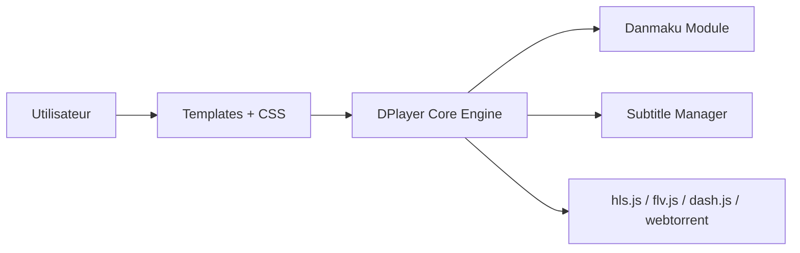

# DIYgod/DPlayer

> Lecteur vidéo HTML5 avec danmaku (commentaires défilants), pour sites web et applications.

## Le problème
Afficher de la vidéo en streaming avec commentaires superposés demande d'assembler lecteur, sous-titres et flux.

## Ce que ça fait vraiment
Un lecteur HTML5 gérant HLS, FLV, MPEG-DASH, WebTorrent, MP4, WebM et Ogg, avec danmaku, captures d'écran, raccourcis, changement de qualité, vignettes et sous-titres. Le README liste de nombreux projets liés : API danmaku (Node, PHP, Ruby), plugins WordPress, Hexo, Vue, React.

## Comment c'est branché

## Essayer
Aucune commande dans le README : renvoi vers la documentation externe.

## Coût et pièges
Gratuit. Pour le danmaku, il faut un backend séparé (projets tiers listés). Dernier push en mars 2026 ; 268 issues ouvertes.

## Ce que ce n'est pas
Ce n'est pas un service de streaming : il ne fournit ni encodage ni hébergement. Le README est surtout un annuaire de projets liés et d'utilisateurs, pas un guide d'utilisation.

## Alternatives
DPlayer-Lite (version allégée) et CBPlayer (avec plugin P2P CDNBye), tous deux cités dans le README.

## Pour toi
À ignorer : lecteur vidéo web sans lien avec un travail de data/IA/MLOps.

