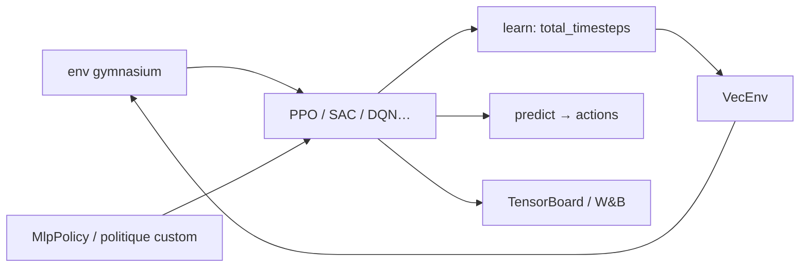

# DLR-RM/stable-baselines3

> Implémentations fiables d'algorithmes d'apprentissage par renforcement en PyTorch.

## Le problème
Les implémentations de RL publiées sont souvent non reproductibles : un même algorithme donne des
résultats très différents selon les détails d'implémentation.

## Ce que ça fait vraiment
SB3 fournit A2C, DDPG, DQN, HER, PPO, SAC et TD3 en PyTorch, avec une interface commune de style
scikit-learn (`model.learn(total_timesteps=...)`, `model.predict(obs)`). La performance de chaque
algorithme a été testée et publiée. Gère environnements et politiques personnalisés, espaces
d'observation `Dict`, callbacks, TensorBoard, annotations de types et haute couverture de tests.
Intégrations Weights & Biases et Hugging Face.

## Comment c'est branché


## Essayer
```bash
pip install 'stable-baselines3[extra]'
pip install -e '.[docs,tests,extra]'
make pytest
make type
make lint
```

## Coût et pièges
Gratuit. Python 3.10+ et PyTorch >= 2.8. L'extra `[extra]` tire TensorBoard, OpenCV, `ale-py`,
pandas et matplotlib. Les mainteneurs annoncent qu'ils ne fournissent ni support technique ni
conseil et ne répondent pas aux questions par email.

## Ce que ce n'est pas
Ce n'est pas un point d'entrée dans le RL : le README prévient qu'il faut déjà connaître le domaine.
Le projet est déclaré *stable*, le développement porte sur les correctifs et la maintenance ; les
nouveaux algorithmes vont dans SB3-Contrib, les variantes rapides dans SBX. Ce n'est pas non plus un
framework d'entraînement complet — c'est le rôle du RL Zoo.

## Alternatives
- SB3-Contrib : Recurrent PPO, CrossQ, TQC, QR-DQN, Maskable PPO, algorithmes plus récents.
- SBX (SB3 + Jax) : jusqu'à 20× plus rapide, mais moins de fonctionnalités.
- RL Baselines3 Zoo : scripts d'entraînement, réglage d'hyperparamètres et configurations réglées.

## Pour toi
La base de référence quand tu dois comparer honnêtement une approche RL maison à un algorithme
établi — et le Zoo t'évite de chercher les hyperparamètres.
