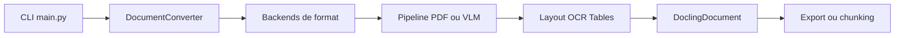

# DS4SD/docling

> Convertit PDF, Office, images et audio en document structuré, pour alimenter des chaînes RAG ou d'IA.

## Le problème
Les PDF et documents bureautiques perdent leur mise en page, leurs tableaux et leur ordre de lecture quand on les passe à un modèle de langage.

## Ce que ça fait vraiment
Docling lit de nombreux formats (PDF, DOCX, PPTX, XLSX, HTML, images, audio, vidéo, courriels, EPUB…) et produit un `DoclingDocument` exportable en Markdown, HTML ou JSON sans perte. Le PDF passe par analyse de mise en page, ordre de lecture, tableaux, formules et OCR ; des modèles visuels (GraniteDocling) sont possibles. Exécution locale, CLI, serveur MCP, docling-serve et intégrations LangChain, LlamaIndex, Crew AI, Haystack.

## Comment c'est branché


## Essayer
```bash
pip install docling
docling https://arxiv.org/pdf/2206.01062
docling --pipeline vlm --vlm-model granite_docling https://arxiv.org/pdf/2206.01062
```
```python
from docling.document_converter import DocumentConverter
converter = DocumentConverter()
result = converter.convert("https://arxiv.org/pdf/2408.09869")
print(result.document.export_to_markdown())
```

## Coût et pièges
Python 3.10 minimum. Les besoins en GPU et en téléchargement de modèles ne sont pas détaillés dans le README. Anomalie : même README que `docling-project/docling`.

## Ce que ce n'est pas
Ce n'est pas un LLM : il prépare les documents. Les fonctions « coming soon » (métadonnées, chimie) ne sont pas livrées.

## Alternatives
Aucune alternative nommée dans le README.

## Pour toi
Adopter : bloc d'ingestion documentaire de référence pour un pipeline RAG, sous MIT et sous l'égide d'une fondation.

