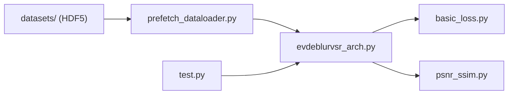

# DachunKai/Ev-DeblurVSR

> Implémentation PyTorch officielle d'une super-résolution vidéo floue guidée par événements (AAAI 2025), pour chercheurs en vision.

## Le problème
Les vidéos floues à basse résolution perdent des détails que les caméras à événements ont capturés : les méthodes classiques ne les exploitent pas.

## Ce que ça fait vraiment
Code de recherche basé sur BasicSR qui prend vidéo et événements (voxels dans un fichier HDF5) et produit une vidéo ×4 nette. Des modèles pré-entraînés sont fournis pour GoPro, BSD et NCER, avec scripts de test en multi-GPU et mesure de paramètres et durée d'exécution. Seule l'inférence/test est documentée, pas l'entraînement.

## Comment c'est branché


## Essayer
```bash
conda create -y -n ev-deblurvsr python=3.7
conda activate ev-deblurvsr
git clone https://github.com/DachunKai/Ev-DeblurVSR
cd Ev-DeblurVSR && pip install -r requirements.txt && python setup.py develop
./scripts/dist_test.sh [num_gpus] options/test/EvDeblurVSR/test_EvDeblurVSR_GoPro_x4.yml
```

## Coût et pièges
Pile ancienne (Python 3.7, CUDA 11.1.1, torch 1.10.2). Poids et jeux de test à télécharger depuis Baidu Cloud ou Google Drive. Il faut des données d'événements, rares hors de ces jeux.

## Ce que ce n'est pas
Pas une application ni une API : du code d'article de recherche. Ne traite pas de vidéos sans données d'événements.

## Alternatives
Le README cite EvTexture, du même auteur, dont il réutilise l'image Docker.

## Pour toi
Ignorer : niche de recherche dépendant de caméras à événements, avec une pile logicielle datée.
