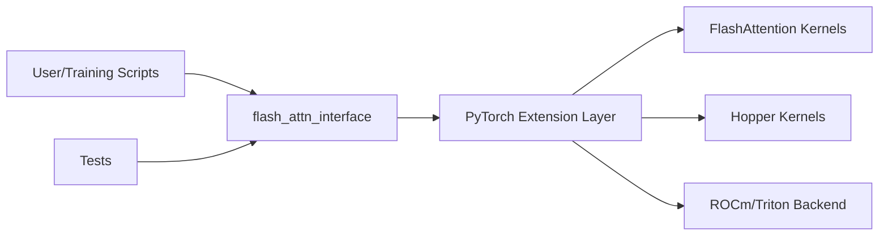

# Dao-AILab/flash-attention

> Noyaux GPU d'attention exacte (FlashAttention 2, 3 bêta, 4) pour PyTorch, destinés à qui entraîne ou sert des transformers.

## Le problème
L'attention standard consomme une mémoire quadratique en longueur de séquence et sature vite le GPU.

## Ce que ça fait vraiment
Fournit des noyaux CUDA (et ROCm/Triton pour AMD) pour l'attention avec passe avant et arrière, masque causal, fenêtre glissante, ALiBi, MQA/GQA, softcapping et cache KV paginé. Le README annonce une mémoire linéaire et 10x d'économie à 2K de séquence. FA3 cible Hopper (H100), FA4 (CuTeDSL) Hopper et Blackwell. Le dépôt contient aussi un modèle GPT et des scripts d'entraînement.

## Comment c'est branché


## Essayer
```bash
pip install flash-attn --no-build-isolation
MAX_JOBS=4 pip install flash-attn --no-build-isolation
pip install flash-attn-4
pytest -q -s tests/test_flash_attn.py
```

## Coût et pièges
GPU NVIDIA/AMD obligatoire, Linux de préférence. Sans `ninja`, la compilation peut durer 2 h ; avec moins de 96 Go de RAM, limiter `MAX_JOBS`. FA3 exige H100/H800 et CUDA ≥ 12.3.

## Ce que ce n'est pas
Ce n'est pas un framework d'entraînement complet, ni une solution CPU. `flash_attn_with_kvcache` ne gère pas la passe arrière. FA3 est annoncée bêta.

## Alternatives
- Implémentation Triton de Phil Tillet (OpenAI) : plus lisible pour expérimenter.
- Bibliothèque `kernels` de Hugging Face : noyaux FA2/FA3 précompilés.

## Pour toi
Adopter si tu entraînes ou sers des LLM sur GPU : c'est la brique de référence, la vraie contrainte est la compilation et la version de CUDA.

