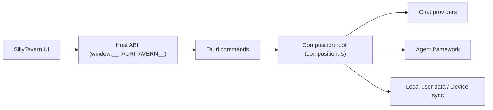

# Darkatse/TauriTavern

> Client natif de SillyTavern (Rust/Tauri v2) pour desktop et mobile, sans Node.js à installer.

## Le problème
SillyTavern demande Node.js et une ligne de commande, et n'a pas de vraie application mobile ou de bureau.

## Ce que ça fait vraiment
Reprend le frontend de SillyTavern (synchronisé avec 1.18.0) et remplace le backend Node par un backend Rust (Cargo workspace, architecture propre). Compatible avec cartes de personnage, chats, préréglages et extensions frontend (pas les plugins Node). Ajoute synchronisation multi-appareils, framework d'agents (outils, skills, sous-agents) et import depuis SillyTavern. Le README est en chinois.

## Comment c'est branché


## Essayer
```bash
winget install --id TauriTavern.TauriTavern
brew install --cask tauritavern
curl -fsSL https://get.tauritavern.com/linux.sh | sh
```

## Coût et pièges
Gratuit ; les fournisseurs d'IA restent à ta charge (clés). La version iOS passe par TestFlight, avec ses limites. AGPL-3.0.

## Ce que ce n'est pas
Pas le client officiel de SillyTavern : projet indépendant. Les plugins Node de SillyTavern ne sont pas supportés.

## Alternatives
- SillyTavern : l'original, dont il est un portage.

## Pour toi
À ignorer pour ton métier : application de jeu de rôle avec un LLM, sans lien avec la data ou le MLOps.
