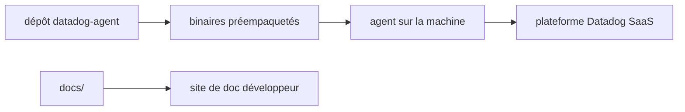

# DataDog/datadog-agent

> Code source de l'agent Datadog versions 6 et 7, collecteur installé sur les machines surveillées.

## Le problème
Remonter métriques, traces et journaux d'une machine vers une plateforme d'observabilité demande un collecteur.
Sans lui, rien n'arrive dans Datadog.

## Ce que ça fait vraiment
Le README est très court : il annonce le dépôt du code source des agents v6 et v7 et rien de plus.
Il renvoie à la documentation utilisateur pour les différences entre les versions v5, v6 et v7.
Il signale une liste de binaires préempaquetés pour une installation simple.
Le site de documentation développeur, dont les sources sont sous `docs/`, explique comment travailler sur l'agent.

## Comment c'est branché

## Essayer
Aucune commande documentée dans le README : il renvoie à la liste de binaires préempaquetés.

## Coût et pièges
L'agent est ouvert, la plateforme ne l'est pas : un compte Datadog payant est nécessaire pour en faire quelque chose.
Toute la donnée collectée part chez un tiers.

## Ce que ce n'est pas
Pas une plateforme d'observabilité autonome : sans backend Datadog, l'agent n'a nulle part où envoyer.
Pas documenté ici : le README ne décrit ni installation, ni configuration, ni fonctionnement.
Pas un collecteur générique type OpenTelemetry.

## Alternatives
Aucune alternative nommée dans le README.

## Pour toi
Sans intérêt si tu n'es pas déjà client Datadog ; matière insuffisante pour juger autrement.
