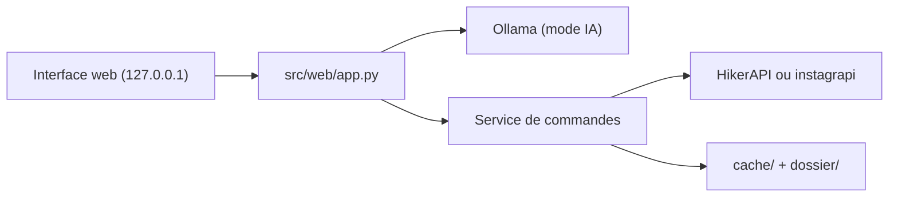

# Datalux/Osintgram

> Interface web locale d'analyse OSINT de profils Instagram publics, avec un mode assisté par modèle local.

## Le problème
Rassembler et croiser ce qu'un profil Instagram public révèle (abonnés, légendes, hashtags, lieux, horaires de publication).

## Ce que ça fait vraiment
Une application web (FastAPI, servie sur 127.0.0.1) offre 28 commandes : profil, réseau, contenus, contacts publics, recherches par hashtag ou lieu. Le mode IA passe par Ollama en local pour choisir les commandes ; le mode base n'utilise aucun modèle. Elle chiffre le coût d'une recherche, met les requêtes en cache, affiche cartes et grilles, et exporte un rapport HTML.

## Comment c'est branché


## Essayer
```bash
pip install -r requirements.txt
uvicorn src.web.app:app --host 127.0.0.1 --port 8000 --reload
ollama pull llama3.1:8b
docker compose up --build
```

## Coût et pièges
Les données Instagram viennent d'un fournisseur payant (clé HikerAPI) ou d'un compte Instagram à toi (instagrapi), à ne pas prendre comme compte principal. Aucune authentification sur l'interface : ne pas l'exposer hors localhost. Clé stockée dans `config/credentials.ini`, à ne jamais commiter. GPL-3.0.

## Ce que ce n'est pas
Ne voit pas les profils privés. Le README le déclare « à but éducatif » et rappelle que les résultats contiennent des données personnelles soumises au RGPD et aux conditions d'Instagram.

## Alternatives
Le README nomme HikerAPI et instagrapi comme fournisseurs de données, pas comme alternatives à l'outil.

## Pour toi
Ignorer : OSINT sur des personnes, hors profil, dépendant d'un fournisseur payant et lourd en obligations de protection des données.

