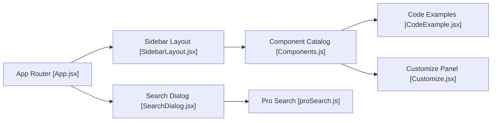

# DavidHDev/react-bits

> Bibliothèque de plus de 200 composants React animés à copier, pour textes, fonds et micro-interactions.

## Le problème
Écrire des animations d'interface soi-même prend des heures.

## Ce que ça fait vraiment
Un site de documentation où l'on parcourt un catalogue, on modifie les propriétés d'un composant en direct puis on copie le code. Chaque composant existe en quatre variantes (JS ou TS, CSS ou Tailwind). Il propose aussi des outils : Background Studio, Shape Magic, Texture Lab. L'installation se fait avec shadcn ou jsrepo.

## Comment c'est branché


## Essayer
```bash
npx shadcn@latest add @react-bits/BlurText-TS-TW
```

## Coût et pièges
Gratuit d'après le README. La licence est « présente mais non identifiée » par GitHub : à vérifier avant réutilisation. Un catalogue « Pro » apparaît dans l'architecture sans détail dans le README.

## Ce que ce n'est pas
Ce n'est pas un paquet à importer comme une dépendance classique : on copie le code dans son projet. Le README dit que certains composants s'inspirent de code public.

## Alternatives
- Vue Bits (vue-bits.dev) : port pour Vue.
- Svelte Bits (sveltebits.xyz) : port pour Svelte.

## Pour toi
À ignorer : animations d'interface sans lien avec un travail data/IA, avec une licence encore à clarifier.

