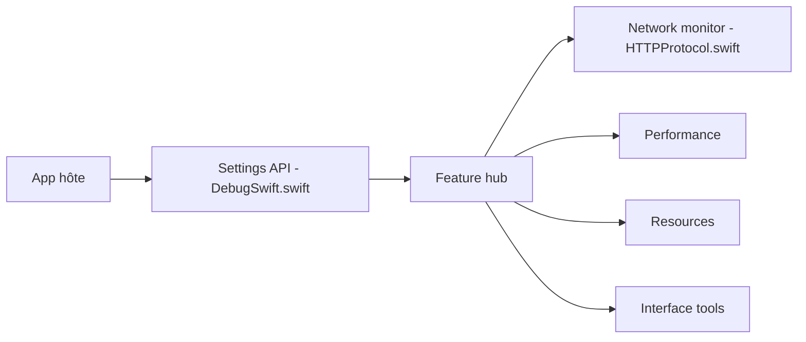

# DebugSwift/DebugSwift

> Boîte à outils de débogage embarquée pour applications iOS en Swift, avec inspecteur réseau et performances.

## Le problème
Déboguer une app iOS en cours d'exécution demande souvent plusieurs outils séparés pour le réseau, la mémoire et l'interface.

## Ce que ça fait vraiment
Une bibliothèque injectée dans l'application en debug : inspecteur HTTP et WebSocket (avec modification de réponses), métriques CPU/mémoire/FPS, détection de fuites, rapports de crash, console, navigateur de fichiers, UserDefaults, Keychain, bases SQLite/Realm/SwiftData, hiérarchie de vues 3D, simulation de notifications push. Elle s'appuie sur le swizzling et l'interception `URLProtocol`. Un bouton flottant ouvre le menu.

## Comment c'est branché


## Essayer
```swift
import DebugSwift
#if DEBUG
debugSwift.setup()
debugSwift.show()
#endif
```
Installation : Swift Package Manager (`https://github.com/DebugSwift/DebugSwift`) ou `pod 'DebugSwift'`.

## Coût et pièges
Exige iOS 14+, Swift 6, Xcode 16. À entourer de `#if DEBUG` : il expose fichiers, Keychain et trafic réseau. Les fonctions SwiftUI et l'historique de sessions réseau sont en bêta.

## Ce que ce n'est pas
Ce n'est pas un outil de surveillance en production. Il ne couvre pas d'autres plateformes qu'iOS.

## Alternatives
CocoaDebug et DBDebugToolkit, cités comme références dans le README.

## Pour toi
À ignorer : outil de débogage iOS, hors périmètre data, IA ou MLOps.

