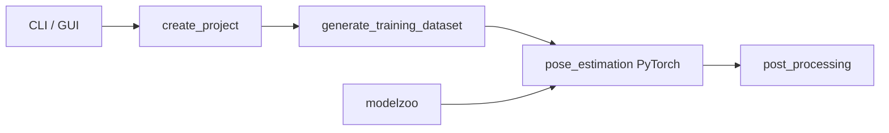

# DeepLabCut/DeepLabCut

> Boîte à outils d'estimation de pose sans marqueurs, pour animaux et objets, avec GUI.

## Le problème
Suivre les mouvements d'un animal en vidéo demandait des marqueurs physiques ou un annotateur à temps plein.

## Ce que ça fait vraiment
Création de projet, étiquetage, génération du jeu d'entraînement, entraînement, analyse vidéo, post-traitement.
Backend PyTorch depuis la v3.0 (TensorFlow en voie d'abandon), multi-animaux, 3D multi-caméras.
Modèles pré-entraînés SuperAnimal (quadrupèdes, souris vue de dessus) ; package temps réel séparé.
GUI et API Python ; démos Colab.

## Comment c'est branché

(Le graphe GitDiagram fourni est vide : nœuds repris de l'explication d'architecture.)

## Essayer
```bash
pip install torch torchvision
pip install --pre "deeplabcut[gui]"
```

## Coût et pièges
Gratuit ; GPU CUDA conseillé, versions PyTorch/CUDA à accorder. Python 3.10+.

## Ce que ce n'est pas
Pas un détecteur généraliste sans annotation : il faut étiqueter quelques images, sauf à se contenter des SuperAnimal. LGPL-3.0.

## Alternatives
Aucune alternative nommée dans le README.

## Pour toi
À surveiller : référence incontournable si un projet touche au comportement animal ou à la biomécanique, hors de ce créneau inutile.
