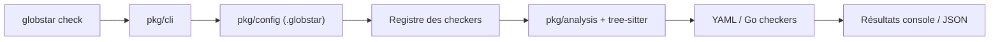

# DeepSourceCorp/globstar

> Boîte à outils d'analyse statique en Go pour écrire des vérificateurs de code avec des requêtes tree-sitter.

## Le problème
Appliquer des règles de code propres à son équipe (sécurité, performance) oblige à choisir des règles génériques ou à construire un outillage maison.

## Ce que ça fait vraiment
Un binaire unique (`globstar check`) exécute les vérificateurs intégrés et ceux du dossier `.globstar`. Chaque règle simple est un YAML avec une requête tree-sitter ; les règles avancées s'écrivent en Go avec accès à l'AST et à la résolution de portée. Il s'intègre en CI et signale les problèmes trouvés.

## Comment c'est branché


## Essayer
```bash
curl -sSL https://get.globstar.dev | sh
./bin/globstar check
curl -sSL https://get.globstar.dev | BINDIR=$HOME/.local/bin sh
mv ./bin/globstar /usr/local/bin
```

## Coût et pièges
Gratuit, sans dépendance. Le script d'installation est exécuté via `curl | sh`. Il faut apprendre la syntaxe des requêtes tree-sitter.

## Ce que ce n'est pas
Ce n'est pas un analyseur clé en main avec des règles exhaustives : sa valeur vient de tes règles. L'intégration avec DeepSource est annoncée comme future.

## Alternatives
Le README ne cite aucune alternative nommée (il évoque les analyseurs propriétaires de DeepSource).

## Pour toi
À surveiller : pratique pour imposer des règles maison (secrets, appels dangereux) dans des dépôts de code data/IA, à tester sur un cas précis.

