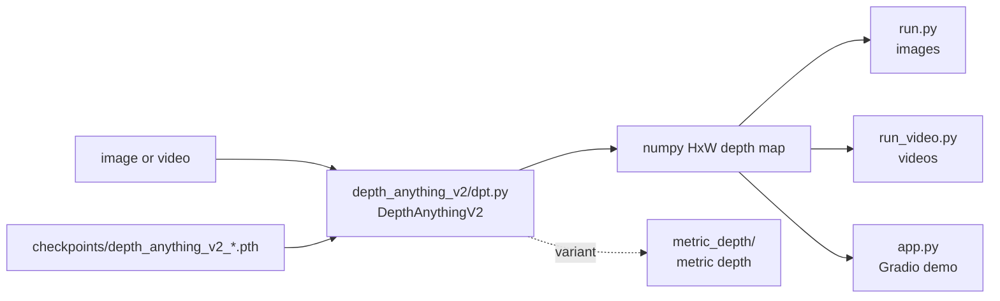

# DepthAnything/Depth-Anything-V2

> **One sentence.** Four monocular depth estimation models you run on an image or a video.

## The problem

Without a monocular depth model, getting a depth map out of a plain photo means a dedicated
sensor or a reconstruction pipeline. The README positions this work against
[V1](https://github.com/LiheYoung/Depth-Anything) (fine-grained details, robustness) and
against SD-based models (inference speed, parameter count, depth accuracy).

## What it actually does

The repository ships four **relative** depth models at different scales: Small (24.8M),
Base (97.5M), Large (335.3M) and Giant (1.3B, announced as "coming soon"). The
`DepthAnythingV2` class is built from an encoder config (`vits`, `vitb`, `vitl`, `vitg`),
loads a `.pth` checkpoint, and exposes `infer_image(raw_img)`, which returns an HxW raw depth
map as numpy. Two inference scripts ship with the library, one for images and one for videos,
plus a Gradio demo. A separate track covers **metric** depth (the `metric_depth` folder), and
a DA-2K evaluation benchmark is provided.

## How it is wired



No code-derived diagram exists for this repository; the nodes above reuse the file names the
README itself gives. The README notes that V2 decodes from DINOv2 *intermediate features*
(`depth_anything_v2/dpt.py`), where V1 unintentionally used the last four layers.

## Trying it

```bash
git clone https://github.com/DepthAnything/Depth-Anything-V2
cd Depth-Anything-V2
pip install -r requirements.txt
```

```bash
python run.py --encoder vitl --img-path assets/examples --outdir depth_vis
```

```bash
python run_video.py \
  --encoder <vits | vitb | vitl | vitg> \
  --video-path assets/examples_video --outdir video_depth_vis \
  [--input-size <size>] [--pred-only] [--grayscale]
```

```bash
python app.py
```

Without cloning, the README also gives the Transformers route:
`pipeline(task="depth-estimation", model="depth-anything/Depth-Anything-V2-Small-hf")`.

## Cost and gotchas

Code and weights download with no API key and no paid account, but checkpoints are fetched by
hand from Hugging Face and dropped into `checkpoints/`. The real cost is the license:
**only the Small model is Apache-2.0**, while Base, Large and Giant are CC-BY-NC-4.0, i.e.
non-commercial. Second gotcha: the README recommends using the repository directly rather
than Transformers, since predictions differ slightly because of the upsampling difference
between OpenCV and Pillow. The code picks `cuda`, then `mps`, then `cpu`: CPU works, but
Large is 335M parameters.

## What it is not

It is not metric depth by default: the four listed models produce *relative* depth, and the
metric variant is a separate folder with its own weights. It is also not a temporally stable
video model: the README only claims the larger model has "better temporal consistency", and
points to Video Depth Anything for very long videos. Finally, the Apache-2.0 license listed
in the catalogue does not cover the three larger models.

## Alternatives

- [LiheYoung/Depth-Anything](https://github.com/LiheYoung/Depth-Anything) (V1): the previous
  version, which the README describes as less detailed and less robust.
- [Video Depth Anything](https://videodepthanything.github.io): preferable for consistent
  depth maps over very long videos.
- [Prompt Depth Anything](https://promptda.github.io/): when a low-res LiDAR is available to
  prompt 4K metric depth estimation.

## Why it matters to you

A perception building block usable as-is in a data/vision pipeline: an image in, a numpy
array out, and the Transformers integration avoids vendoring the repository. The decision
point is legal before it is technical — commercial use means sticking to the Small model.
