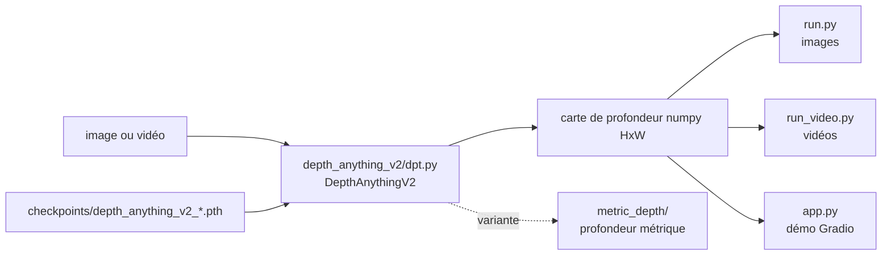

# DepthAnything/Depth-Anything-V2

> **Une phrase.** Quatre modèles d'estimation de profondeur monoculaire, à charger sur une image ou une vidéo.

## Le problème

Sans un modèle de profondeur monoculaire, obtenir une carte de profondeur depuis une simple
photo demande un capteur dédié ou un pipeline de reconstruction. Le README situe le travail
par rapport à [V1](https://github.com/LiheYoung/Depth-Anything) (détails fins, robustesse) et
par rapport aux modèles à base de diffusion (vitesse d'inférence, nombre de paramètres,
exactitude de la profondeur).

## Ce que ça fait vraiment

Le dépôt publie quatre modèles de profondeur **relative** à des échelles différentes :
Small (24,8 M), Base (97,5 M), Large (335,3 M) et Giant (1,3 B, annoncé « coming soon »).
La classe `DepthAnythingV2` se construit depuis une configuration d'encodeur (`vits`, `vitb`,
`vitl`, `vitg`), charge un checkpoint `.pth`, et expose `infer_image(raw_img)` qui rend une
carte de profondeur numpy HxW. Deux scripts d'inférence accompagnent la bibliothèque, l'un
sur images, l'autre sur vidéos, plus une démo Gradio. Un volet séparé traite la profondeur
**métrique** (dossier `metric_depth`), et un benchmark d'évaluation DA-2K est fourni.

## Comment c'est branché



Aucun diagramme tiré du code n'existe pour ce dépôt ; les nœuds ci-dessus reprennent les
fichiers nommés dans le README. Le README précise que V2 décode depuis les *features
intermédiaires* de DINOv2 (`depth_anything_v2/dpt.py`), là où V1 utilisait par inadvertance
les quatre dernières couches.

## Essayer

```bash
git clone https://github.com/DepthAnything/Depth-Anything-V2
cd Depth-Anything-V2
pip install -r requirements.txt
```

```bash
python run.py --encoder vitl --img-path assets/examples --outdir depth_vis
```

```bash
python run_video.py \
  --encoder <vits | vitb | vitl | vitg> \
  --video-path assets/examples_video --outdir video_depth_vis \
  [--input-size <size>] [--pred-only] [--grayscale]
```

```bash
python app.py
```

Sans cloner le dépôt, le README donne aussi le chemin Transformers :
`pipeline(task="depth-estimation", model="depth-anything/Depth-Anything-V2-Small-hf")`.

## Coût et pièges

Le code et les poids sont téléchargeables sans clé d'API ni compte payant, mais les
checkpoints se récupèrent à la main depuis Hugging Face et se posent dans `checkpoints/`.
Le vrai coût est la licence : **seul le modèle Small est en Apache-2.0**, Base, Large et
Giant sont en CC-BY-NC-4.0, donc non commercial. Deuxième piège : le README recommande
l'usage direct du dépôt plutôt que Transformers, les prédictions différant légèrement à
cause de l'écart d'upsampling entre OpenCV et Pillow. Le code choisit `cuda`, sinon `mps`,
sinon `cpu` : le CPU reste possible mais le Large fait 335 M de paramètres.

## Ce que ce n'est pas

Ce n'est pas de la profondeur **métrique** par défaut : les quatre modèles listés font de la
profondeur *relative*, la version métrique est un dossier à part, avec ses propres poids.
Ce n'est pas non plus un modèle vidéo temporellement stable : le README dit seulement que le
plus gros modèle a une « meilleure cohérence temporelle », et renvoie vers Video Depth
Anything pour les vidéos longues. Enfin la licence Apache-2.0 annoncée au catalogue ne couvre
pas les trois plus gros modèles.

## Alternatives

- [LiheYoung/Depth-Anything](https://github.com/LiheYoung/Depth-Anything) (V1) : la version
  précédente, que le README présente comme moins fine et moins robuste.
- [Video Depth Anything](https://videodepthanything.github.io) : à préférer pour des cartes
  de profondeur cohérentes sur des vidéos très longues.
- [Prompt Depth Anything](https://promptda.github.io/) : quand on dispose d'un LiDAR basse
  résolution pour guider une estimation métrique 4K.

## Pour toi

Brique de perception réutilisable telle quelle dans un pipeline data/vision : une image
entre, un tableau numpy sort, et l'intégration Transformers évite d'embarquer le dépôt.
Le point de décision est juridique avant d'être technique — si l'usage est commercial, il
faut se limiter au modèle Small.
