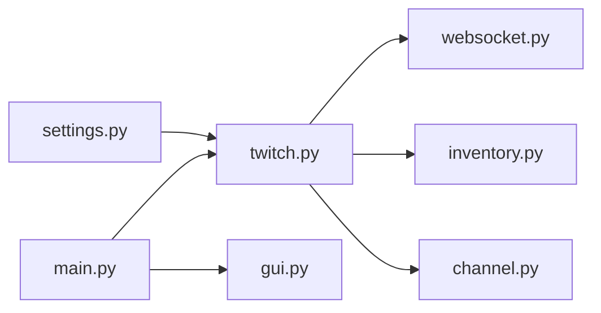

# DevilXD/TwitchDropsMiner

> Application de bureau qui fait avancer les « drops » Twitch sans télécharger le flux vidéo.

## Le problème
Gagner des récompenses Twitch exige de garder des flux ouverts et de changer de chaîne à la main.

## Ce que ça fait vraiment
Se connecte à ton compte, liste les campagnes, choisit une chaîne éligible, simule le visionnage par métadonnées de flux et réclame les récompenses. Un websocket suit les passages en ligne ou hors ligne. Priorités et exclusions de jeux, bascule automatique entre chaînes.

## Comment c'est branché

## Essayer
Télécharger et décompresser la dernière release, lancer l'application, se connecter, ajouter des jeux à la liste de priorité puis « Reload ». Aucune commande documentée.

## Coût et pièges
Gratuit. Le fichier `cookies.jar` donne accès au compte Twitch : à protéger. Regarder un flux sur le même compte fausse la progression.

## Ce que ce n'est pas
Ni Docker, ni exécution sans interface, ni multi-comptes, ni serveur 24/7 : refusés par l'auteur. L'exécutable Windows peut être signalé par les antivirus.

## Alternatives
Aucune citée dans le README.

## Pour toi
Utilitaire de joueur, sans rapport avec data/IA, et reposant sur un service tiers : ignorer.

