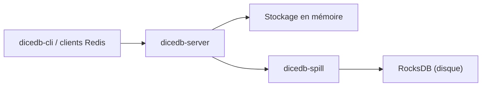

# DiceDB/dice

> Fork de Valkey (lui-même fork de Redis) qui ajoute une persistance des clés évincées sur disque.

## Le problème
Un cache en mémoire perd les clés évincées : on veut un jeu de travail plus grand que la RAM sans quitter l'écosystème Redis.

## Ce que ça fait vraiment
Reste compatible avec les outils et SDK Redis/Valkey. Ajoute le module `dicedb-spill` : il écrit sur disque (RocksDB par défaut, limite de mémoire de 250 Mo) les clés évincées et les restaure à la demande. L'ancienne version en Go, réactive, est archivée (dice-legacy) ; certaines fonctions seront portées.

## Comment c'est branché


## Essayer
```bash
docker run \
    --name dicedb-001 \
    -p 6379:6379 -v $(pwd)/data:/data/ \
    dicedb/dicedb
docker exec -it dicedb-001 dicedb-cli
```

## Coût et pièges
Gratuit. Références Valkey encore présentes dans les journaux et le code. Le catalogue ne renseigne pas la licence ; à vérifier (Valkey est sous BSD, mais le README ne le dit pas).

## Ce que ce n'est pas
Pas le DiceDB réactif en Go d'origine, désormais archivé. Le README n'apporte aucun chiffre de performance.

## Alternatives
Le README cite Valkey et Redis comme bases compatibles, et dice-legacy pour l'ancienne version.

## Pour toi
Surveiller : à considérer si tu veux un cache Redis avec débordement sur disque, mais la seule différence documentée est ce module de spill.
