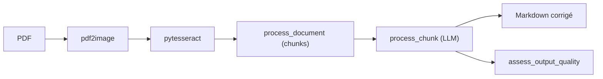

# Dicklesworthstone/llm_aided_ocr

> Script qui corrige la sortie d'un OCR Tesseract avec un LLM et la reformate en Markdown.

## Le problème
Tesseract laisse des erreurs, des césures et des en-têtes qui polluent le texte extrait d'un PDF.

## Ce que ça fait vraiment
Convertit le PDF en images, applique Tesseract, découpe le texte en chunks avec recouvrement, fait corriger chaque chunk par un LLM (llama.cpp local, OpenAI ou Anthropic), reformate en Markdown avec suppression de doublons, en-têtes et numéros de page, puis évalue la qualité par un score LLM. Traitement asynchrone pour les API. Sorties : `_raw_ocr_output.txt` et `_llm_corrected.md`.

## Comment c'est branché


## Essayer
```bash
git clone https://github.com/Dicklesworthstone/llm_aided_ocr
cd llm_aided_ocr
python -m venv venv && source venv/bin/activate
pip install -r requirements.txt
sudo apt-get install tesseract-ocr
python llm_aided_ocr.py
```

## Coût et pièges
Clé OpenAI ou Anthropic à ta charge, ou un GGUF local. Python 3.12+. Le chemin du PDF est à éditer dans `main()`. Licence non identifiée par GitHub.

## Ce que ce n'est pas
Pas un OCR : la qualité dépend du LLM et d'un Tesseract déjà lancé. Un LLM peut « corriger » en réécrivant ; le README ne parle pas de garde-fou.

## Alternatives
Non documenté dans le README.

## Pour toi
Surveiller : le schéma OCR puis correction LLM est réutilisable, mais c'est un script à adapter et non un outil stabilisé.
