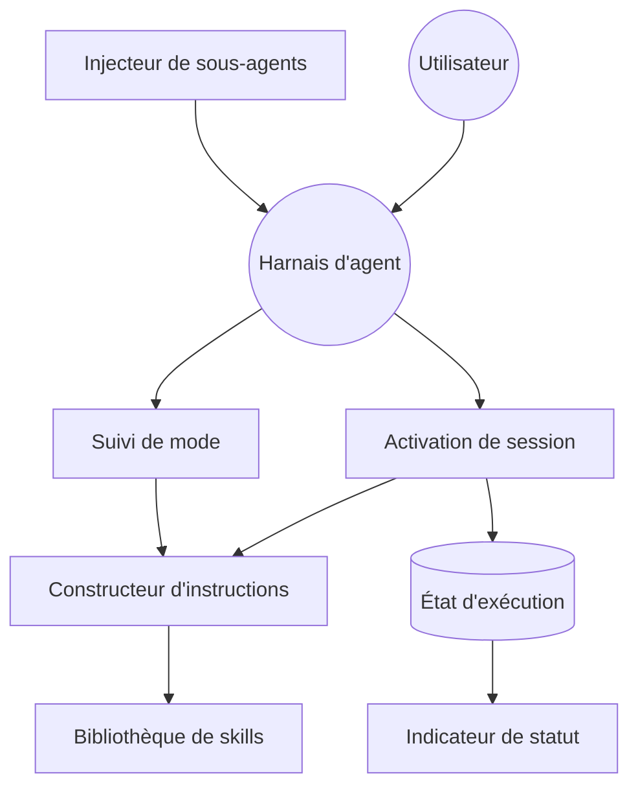

# DietrichGebert/ponytail

> Règle injectée dans un agent de code pour qu'il écrive le minimum de code nécessaire.

## Le problème
Un agent de code sur-construit : il installe une dépendance là où une balise HTML native suffirait.
Le résultat est plus long à relire, plus cher en tokens et plus coûteux à maintenir.

## Ce que ça fait vraiment
Injecte avant chaque génération une échelle de sept questions : est-ce nécessaire, existe-t-il déjà, la stdlib le fait-elle, etc.
Quatre intensités (`lite`, `full`, `ultra`, `off`) réglables en cours de session ou par variable d'environnement.
Six commandes : revue du diff, audit du dépôt, ledger de dette, tableau des gains, aide.
Adaptateurs pour une vingtaine de harnais ; la règle passe aussi dans les sous-agents.

## Comment c'est branché


## Essayer
```bash
codex plugin marketplace add DietrichGebert/ponytail
codex plugin add ponytail@ponytail
node scripts/check-rule-copies.js
npm test
```

## Coût et pièges
Gratuit. `node` doit être sur le PATH non interactif, sinon l'activation permanente reste muette.
La désinstallation laisse des fichiers d'état hors du dossier du plugin ; `node scripts/uninstall.js` les nettoie.

## Ce que ce n'est pas
Pas un linter : rien n'est vérifié après coup, c'est une consigne de génération.
Les chiffres annoncés (−54 % de LOC) viennent d'un banc de 12 tâches sur un seul dépôt, avec Haiku 4.5.
Sur un modèle de raisonnement verbeux, l'effet coût peut s'inverser — le README le dit pour GPT-5.5.

## Alternatives
- `addyosmani/agent-skills` : couvre le cycle complet, dont une skill de simplification.
- `affaan-m/ECC` : même logique de règles injectées, à une tout autre échelle.

## Pour toi
Une seule règle, mesurée, facile à retirer. Bon rapport bénéfice/risque à tester sur un projet réel.
