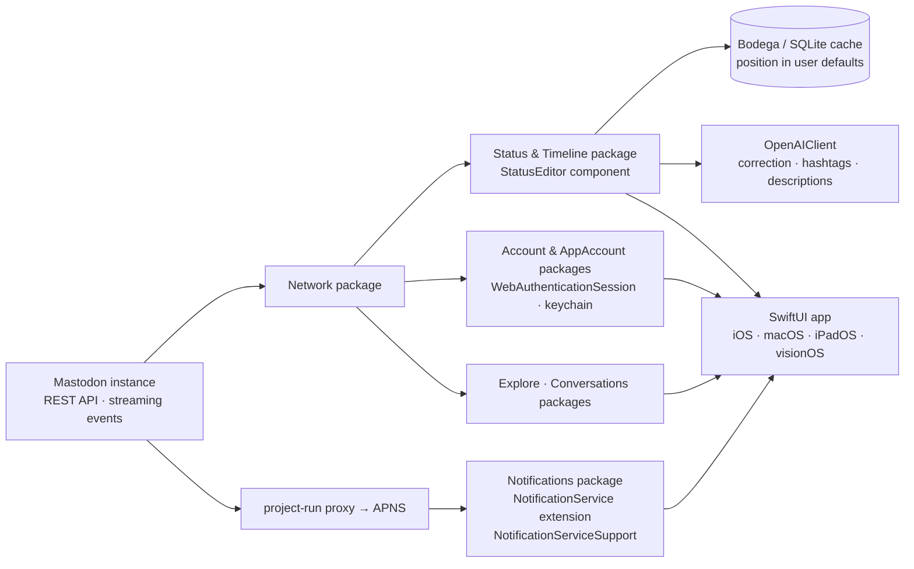

# Dimillian/IceCubesApp

> **A SwiftUI Mastodon client for iOS, macOS, iPadOS and visionOS, readable as sample code.**

## The problem

Reaching Mastodon from an Apple device requires a client: the network's API is open, but
everything else — multi-account authentication, live timelines, push notifications, post
editing — has to be written. For developers, the other gap is a complete, real SwiftUI
application to read: official samples stop short of multiplatform targets, local caching,
system extensions and package-level decomposition.

## What it actually does

IceCubesApp is a Mastodon client written entirely in SwiftUI, shipped on the App Store and
running on iOS, macOS, iPadOS and visionOS, with a dedicated sidebar layout on macOS and
iPadOS. It connects to any instance and handles an unlimited number of accounts; sign-in goes
through Apple's `WebAuthenticationSession` and the token is stored in the keychain.

The timeline leans on Mastodon's streaming events to show new posts, edits and deletions live.
The home timeline is cached through the third-party library
[Bodega](https://github.com/mergesort/Bodega), a light SQLite wrapper, with the reading
position kept in user defaults and synced across devices via Mastodon's marker API. Two
features are described as Ice Cubes only: tag groups (timelines made of several tags) and
remote local timelines (browsing another instance's public timeline). Lists, server-side
filters and iCloud sync of tag groups, remote timelines and drafts round this out.

The editor covers threads of up to five posts, four images, polls, content warnings, custom
emojis, drafts and Apple's language detection; OpenAI-API-assisted tools correct text and
generate hashtags and image descriptions. Push notifications go through a proxy the project
runs between Mastodon and APNS, required for routing; the README states their content is
decoded on device and cannot be read by the proxy. The rest: an explore/search tab with
trending users, tags, posts and links, a direct messages tab, profiles with server-side notes
and bio translation, themes, customisable gestures and tab bar, sound and haptic feedback.

## How it is wired



No code-derived diagram exists for this repository: the graph above is reconstructed from the
README alone, which annotates each feature with its package (`Code` -> Status & Timeline
package, Notifications package, Explore package, Conversations package, Account & AppAccount
packages, OpenAIClient). The README states the project is split into Swift packages, each
focused on one aspect — UI, networking, data models — and that the architecture is
"straightforward MVVM" with no redux.

## Trying it

The README documents only the Xcode build, preceded by a mandatory configuration step — skip
it and the build fails:

```bash
cp IceCubesApp.xcconfig.template IceCubesApp.xcconfig
```

You then fill in `DEVELOPMENT_TEAM` (your Apple Team ID, found in the Apple Developer Portal)
and `BUNDLE_ID_PREFIX` (your domain in reverse notation), save, and compile. No other command
is documented: no tests, no linting, no command-line build. The other route is installing from
the App Store through the README's link.

## Cost and pitfalls

- **AGPL-3.0 licence**: network copyleft. Reusing code from this repository in a product,
  especially a remotely accessible service, triggers source disclosure. Settle that before
  copying a package "for inspiration".
- **Apple toolchain required**: Xcode, a Mac and an Apple developer account for the team ID.
  Without a valid `DEVELOPMENT_TEAM`, the README explicitly promises an error.
- **An OpenAI key at your expense** for the editor's assisted features: correction, hashtags,
  image descriptions. The README names no model, quota or price.
- **Third-party service dependencies**: the Mastodon instance, iCloud for sync, and above all
  the project-run notification proxy, a mandatory hop between Mastodon and APNS. The README
  documents the privacy of its contents, not the availability of the service.
- **Single maintainer**: the repository carries one person's name, and the stated funding is
  in-app tips and GitHub sponsoring. The app is free; continuity is the hidden cost.
- **Third-party dependencies** beyond the repository's own code (Bodega at minimum, named
  explicitly), resolved at build time.

## What it is not

- **It is not a Mastodon server** or federation software: it is a client, and assumes an
  existing instance and an account on it.
- **It is not a Swift library to import.** The package split serves the app's own maintenance,
  not external reuse: no package-manager installation is documented, and the AGPL makes
  borrowing code a decision rather than a detail.
- **It is not cross-platform outside Apple**: iOS, macOS, iPadOS, visionOS, and nothing else.
  No Android, no web.
- **It is not an AI client**: the OpenAI API appears only as optional writing assistance in the
  editor, never as the product itself.
- **The README's "great starting point for learning SwiftUI" is an invitation to read**, not a
  tutorial: there are no lessons, no exercises and no architecture documentation beyond that
  one README paragraph.

## Alternatives

No comparable alternative in the catalogue: the suggested neighbours are Swift ecosystem
building blocks, not Mastodon clients. `onevcat/Kingfisher` (image loading),
`Juanpe/SkeletonView` (loading placeholders) and `gonzalezreal/swift-markdown-ui` (Markdown
rendering) are UI libraries of the kind an app like this one consumes; `supabase/supabase-swift`
is a hosted-database client, unrelated to federation. The only project named in the README is
[mergesort/Bodega](https://github.com/mergesort/Bodega), used for timeline caching — a
dependency, not a substitute.

## For you

Worth watching, not adopting as a working tool: nothing here serves a data, AI or MLOps
pipeline. The value is elsewhere — a complete, maintained, multiplatform SwiftUI application
whose README maps its own packages, so good reading material if a native Apple project comes
up, and a concrete example of wiring the OpenAI API in as a secondary feature rather than the
product. Skip it if you do not build for Apple platforms: the AGPL and the Xcode toolchain make
it expensive to borrow from.
