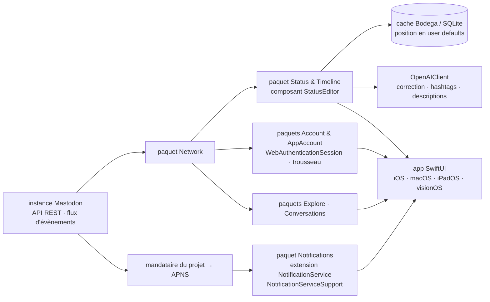

# Dimillian/IceCubesApp

> **Client Mastodon en SwiftUI pour iOS, macOS, iPadOS et visionOS, lisible comme code d'exemple.**

## Le problème

Accéder à Mastodon depuis un appareil Apple suppose un client : l'API du réseau est ouverte,
mais tout le reste — authentification multi-comptes, flux en direct, notifications poussées,
édition de messages — est à écrire. Côté développeur, l'autre manque est celui d'une
application SwiftUI complète et réelle à lire : les exemples officiels s'arrêtent avant le
multiplateforme, le cache local, les extensions système et le découpage en paquets.

## Ce que ça fait vraiment

IceCubesApp est une application cliente de Mastodon écrite entièrement en SwiftUI, publiée sur
l'App Store et fonctionnant sur iOS, macOS, iPadOS et visionOS, avec une barre latérale dédiée
sur macOS et iPadOS. Elle se connecte à n'importe quelle instance et gère un nombre illimité de
comptes, l'authentification passant par `WebAuthenticationSession` d'Apple et le jeton étant
rangé dans le trousseau.

Le fil d'actualité s'appuie sur les événements en flux de Mastodon pour afficher les nouveaux
messages, les éditions et les suppressions en direct. Le fil d'accueil est mis en cache via la
bibliothèque tierce [Bodega](https://github.com/mergesort/Bodega), enveloppe SQLite, la
position de lecture étant conservée dans les réglages utilisateur et synchronisée entre
appareils par l'API marker de Mastodon. Deux fonctions sont annoncées comme propres à Ice
Cubes : les groupes de tags (fils composés de plusieurs tags) et les fils locaux distants
(lecture du fil public d'une autre instance). S'y ajoutent les listes, les filtres côté
serveur, la synchronisation iCloud des groupes de tags, fils distants et brouillons.

L'éditeur gère les fils de cinq messages, quatre images, sondages, avertissements de contenu,
émojis personnalisés, brouillons et détection de langue par l'API Apple ; des outils assistés
par l'API OpenAI y corrigent le texte, génèrent des hashtags et des descriptions d'images. Les
notifications poussées transitent par un mandataire opéré par le projet entre Mastodon et APNS,
nécessaire au routage ; le README indique que leur contenu est déchiffré sur l'appareil et
n'est pas lisible par le mandataire. Le reste : onglet exploration/recherche avec tendances,
onglet messages directs, profils avec notes serveur et traduction de bio, thèmes, gestes et
barre d'onglets personnalisables, retour sonore et haptique.

## Comment c'est branché



Aucun diagramme tiré du code n'existe pour ce dépôt : ce schéma est reconstruit depuis le seul
README, qui annote chaque fonction par le paquet correspondant (`Code` -> Status & Timeline
package, Notifications package, Explore package, Conversations package, Account & AppAccount
packages, OpenAIClient). Le README précise que le projet est découpé en paquets Swift, chacun
sur un aspect — interface, réseau, modèles — et que l'architecture est « straightforward MVVM »
sans redux.

## Essayer

Le README ne documente que la compilation depuis Xcode, précédée d'une étape obligatoire de
configuration — sans elle, la compilation échoue :

```bash
cp IceCubesApp.xcconfig.template IceCubesApp.xcconfig
```

Il faut ensuite renseigner `DEVELOPMENT_TEAM` (l'identifiant d'équipe Apple, à relever dans le
portail développeur Apple) et `BUNDLE_ID_PREFIX` (son domaine en notation inversée), puis
enregistrer avant de compiler. Aucune autre commande n'est documentée : ni test, ni lint, ni
ligne de commande de construction. L'autre voie est l'installation depuis l'App Store, par le
lien du README.

## Coût et pièges

- **Licence AGPL-3.0** : copyleft réseau. Réutiliser du code de ce dépôt dans un produit,
  surtout un service accessible à distance, engage la diffusion des sources. À trancher avant
  de copier un paquet « pour s'inspirer ».
- **Chaîne Apple obligatoire** : Xcode, un Mac et un compte développeur Apple pour l'identifiant
  d'équipe. Sans `DEVELOPMENT_TEAM` valide, le README annonce explicitement une erreur.
- **Clé OpenAI à ta charge** pour les fonctions assistées de l'éditeur : correction, hashtags,
  descriptions d'images. Le README ne donne ni modèle, ni quota, ni coût.
- **Dépendance à des services tiers** : l'instance Mastodon, iCloud pour la synchronisation, et
  surtout le mandataire de notifications opéré par le projet, passage obligé entre Mastodon et
  APNS. Le README documente la confidentialité du contenu, pas la disponibilité du service.
- **Mainteneur unique** : le dépôt porte le nom d'une personne, et le financement annoncé est le
  pourboire dans l'application et le sponsoring GitHub. L'application est gratuite ; c'est la
  continuité qui est le coût caché.
- **Dépendances tierces** au-delà du code du dépôt (Bodega au minimum, cité nommément), à
  résoudre à la compilation.

## Ce que ce n'est pas

- **Ce n'est pas un serveur Mastodon** ni un logiciel de fédération : c'est un client, il
  suppose une instance existante et un compte sur celle-ci.
- **Ce n'est pas une bibliothèque Swift à importer.** Le découpage en paquets sert la
  maintenance de l'application, pas la réutilisation externe : aucune installation par gestionnaire
  de paquets n'est documentée, et l'AGPL rend l'emprunt de code non neutre.
- **Ce n'est pas multiplateforme hors Apple** : iOS, macOS, iPadOS, visionOS, rien d'autre. Pas
  de version Android ni web.
- **Ce n'est pas un client d'IA** : l'API OpenAI n'intervient que comme aide facultative à la
  rédaction dans l'éditeur, pas comme cœur du produit.
- **Le « bon point de départ pour apprendre SwiftUI » du README est une invitation à lire**, pas
  un tutoriel : il n'y a ni cours, ni exercices, ni documentation d'architecture au-delà du
  paragraphe du README.

## Alternatives

Aucune alternative comparable dans le catalogue : les voisins proposés sont des briques
d'écosystème Swift, pas des clients Mastodon. `onevcat/Kingfisher` (chargement d'images),
`Juanpe/SkeletonView` (écrans de chargement) et `gonzalezreal/swift-markdown-ui` (rendu
Markdown) sont des bibliothèques d'interface, du type de celles qu'une application comme
celle-ci consomme ; `supabase/supabase-swift` est un client de base de données hébergée, sans
rapport avec la fédération. Le seul projet nommé dans le README est
[mergesort/Bodega](https://github.com/mergesort/Bodega), utilisé pour le cache du fil — une
dépendance, pas un substitut.

## Pour toi

À surveiller, pas à adopter comme outil de travail : rien ici ne sert un pipeline data, IA ou
MLOps. L'intérêt est ailleurs — c'est une application SwiftUI complète, multiplateforme et
maintenue, dont le README cartographie lui-même les paquets, donc une bonne matière de lecture
si un projet Apple natif se présente, et un exemple concret d'intégration de l'API OpenAI comme
fonction secondaire plutôt que comme produit. Passer son chemin si l'on ne développe pas sur
plateforme Apple : l'AGPL et la chaîne Xcode en font un objet coûteux à emprunter.
