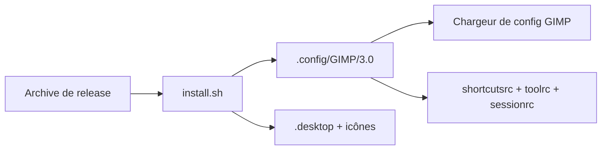

# Diolinux/PhotoGIMP

> Patch de configuration qui donne à GIMP 3 l'apparence et les raccourcis de Photoshop.

## Le problème
Un utilisateur venant de Photoshop perd ses repères dans GIMP : disposition des outils, raccourcis, espace de travail.

## Ce que ça fait vraiment
Ce n'est pas du code exécutable : le dépôt remplace des fichiers de configuration de GIMP (`shortcutsrc`, `toolrc`, `sessionrc`, `dockrc`, `gimprc`, `contextrc`, `theme.css`, `templaterc`, écran de démarrage). Sous Linux, il ajoute un lanceur `.desktop` et des icônes. Le script `install.sh` détecte Flatpak ou installation native et sauvegarde l'existant. Il exige GIMP 3.0+ lancé au moins une fois.

## Comment c'est branché


## Essayer
```bash
cd ~/Downloads/PhotoGIMP-linux
chmod +x install.sh
./install.sh
choco install photogimp
```

## Coût et pièges
Gratuit. Il écrase la configuration de GIMP : le README demande une sauvegarde préalable. Non compatible avec GIMP 2.x.

## Ce que ce n'est pas
Ce n'est pas une nouvelle version de GIMP ni une compatibilité de fichiers Photoshop : seul l'aspect et les raccourcis changent.

## Alternatives
Le README ne cite pas d'alternative.

## Pour toi
À ignorer : personnalisation d'interface graphique sans lien avec data, IA ou MLOps.

