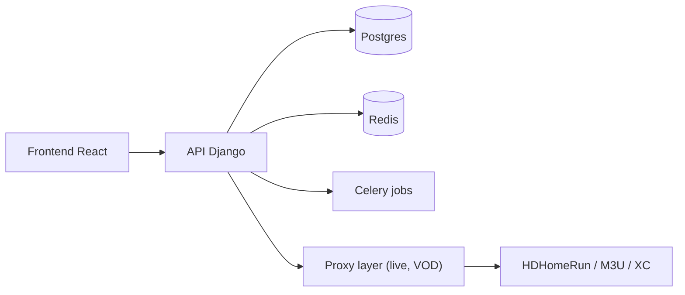

# Dispatcharr/Dispatcharr

> Serveur auto-hébergé qui centralise flux IPTV, guides EPG et VOD pour Plex, Emby et Jellyfin.

## Le problème
Multiplier les fournisseurs IPTV, playlists et guides rend la gestion des chaînes et des enregistrements difficile.

## Ce que ça fait vraiment
Monolithe Django avec front React : import M3U/Xtream Codes, appariement EPG, proxy de flux avec basculement, DVR, VOD, émulation HDHomeRun, profils de transcodage FFmpeg, comptes multi-utilisateurs, plugins et webhooks. Celery, Redis (pub/sub), Postgres.

## Comment c'est branché


## Essayer
```bash
docker pull ghcr.io/dispatcharr/dispatcharr:latest
docker run -d \
  -p 9191:9191 \
  --name dispatcharr \
  -v dispatcharr_data:/data \
  ghcr.io/dispatcharr/dispatcharr:latest
```

## Coût et pièges
Il faut fournir ses propres abonnements IPTV. La première configuration web est limitée aux réseaux privés par défaut ; derrière un proxy, régler `DISPATCHARR_TRUSTED_PROXIES`.

## Ce que ce n'est pas
Ne fournit aucun contenu. Compilation depuis les sources « non officiellement supportée ».

## Alternatives
- Aucune alternative citée dans le README.

## Pour toi
À ignorer : outil de médiacentre domestique, sans lien avec les métiers data/IA/MLOps.

