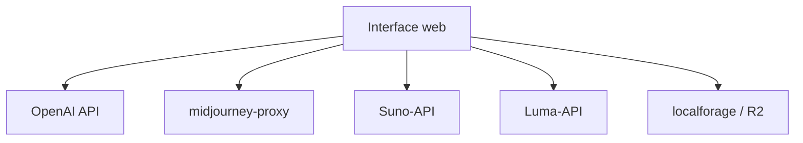

# Dooy/chatgpt-web-midjourney-proxy

> Interface web unifiant ChatGPT, Midjourney, Suno, Luma, Runway et d'autres services génératifs.

## Le problème
Chaque service génératif (image, musique, vidéo) a sa propre interface et son API. Piloter Midjourney, Suno, Luma depuis un même front demande de tout recâbler.

## Ce que ça fait vraiment
Fork de ChatGPT-web ajoutant Midjourney (texte→image, variations, upscale, remix, InsightFace face-swap), Suno/udio (musique), pika/kling/runway/luma (vidéo), ideogram/flux/dall-e (image), OpenAI realtime, TTS/whisper. Toutes les fonctions ChatGPT-web d'origine, clé/base_url personnalisables, stockage local des images, protection anti-brute-force. Utilise midjourney-proxy, Suno-API, Luma-API comme backends.

## Comment c'est branché


## Essayer
```bash
docker run --name chatgpt-web-midjourney-proxy -d -p 6015:3002 \
-e OPENAI_API_KEY=sk-xxxxx \
-e OPENAI_API_BASE_URL=https://api.openai.com \
-e MJ_SERVER=https://your-mj-server:6013 \
-e MJ_API_SECRET=your-mj-api-secret ydlhero/chatgpt-web-midjourney-proxy
```

## Coût et pièges
Toutes les clés d'API (OpenAI, MJ, Suno, Luma…) à ta charge, plus des services de relais tiers recommandés. Dépend de plusieurs SaaS et de proxies non officiels.

## Ce que ce n'est pas
Pas un fournisseur de modèles : une façade qui appelle des API et proxies tiers. Ni officiel ni affilié à OpenAI/Midjourney.

## Alternatives
- ChenZhaoYu/chatgpt-web : le projet d'origine, sans les intégrations média.

## Pour toi
Hors périmètre data/IA pro : orienté usage créatif grand public, dépendances tierces multiples — ignorer.
