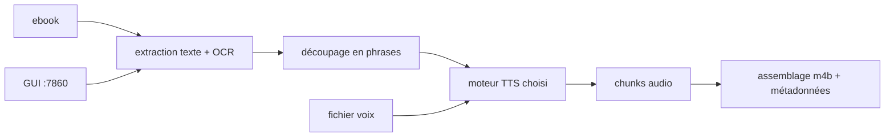

# DrewThomasson/ebook2audiobook

> Convertit un livre numérique en livre audio chapitré, avec clonage de voix optionnel.

## Le problème
Les livres audio commerciaux ne couvrent qu'une fraction des ouvrages, et jamais tes propres documents.
Coller un moteur TTS sur un EPUB à la main donne un fichier sans chapitres ni métadonnées.

## Ce que ça fait vraiment
Lit epub, mobi, azw3, pdf, docx, html, odt et même des images via OCR, et sort m4b, mp3, flac, wav, ogg.
Bascule entre XTTSv2, Bark, Fairseq, VITS, Tacotron2, Tortoise, GlowTTS, YourTTS et Piper selon la langue.
Accepte un fichier voix de 1 à 5 minutes pour le clonage, et des balises SML `[break]`, `[pause:N]`, `[voice:...]`.
Fonctionne en interface Gradio sur `localhost:7860` ou en mode `--headless` scriptable.

## Comment c'est branché


## Essayer
```bash
git clone https://github.com/DrewThomasson/ebook2audiobook.git
cd ebook2audiobook
./ebook2audiobook.command --headless --ebook <path_to_ebook_file> --language eng
```
Sur Windows, `ebook2audiobook.cmd`. En conteneur : image `athomasson2/ebook2audiobook:cpu` avec les volumes
`./ebooks`, `./audiobooks`, `./models`, `./voices`, `./tmp` et le port 7860.

## Coût et pièges
2 Go de RAM et 1 Go de VRAM au minimum, 8 Go / 4 Go recommandés ; le README prévient que les moteurs
modernes sont très lents sur CPU. Sous Docker, MPS n'est pas exposé : Apple Silicon retombe sur CPU.

## Ce que ce n'est pas
Pas un outil pour contourner les DRM : le README limite l'usage aux livres légalement acquis et non protégés.
Pas un découpeur intelligent : l'EPUB n'ayant pas de notion standard de chapitre, il faut nettoyer le texte à la main.
Pas stable sur toutes les langues : le découpage en phrases est explicitement signalé comme à affiner.

## Alternatives
`E2A-SML` — dépôt compagnon des mêmes auteurs pour poser les balises SML automatiquement.
Les moteurs listés comme non encore intégrés (GPT-SoVITS, F5-TTS, Kokoro-TTS, chatterbox) restent des options directes.

## Pour toi
Un bon bac à sable TTS multi-moteurs ; garde-le pour l'usage perso, la qualité dépend trop du couple langue/moteur.
