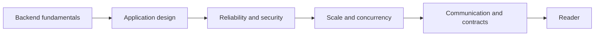

# DsThakurRawat/Backend-from-first-Principle

> Notes de cours sur le développement backend, des bases HTTP aux sujets avancés, pour apprenants.

## Le problème
Les notions de backend (HTTP, routage, bases de données, sécurité) sont dispersées et rarement expliquées depuis les principes.

## Ce que ça fait vraiment
Un dépôt de chapitres en Markdown avec exemples Go et Python, servi comme site PWA installable, lisible hors ligne. Le sommaire suit HTTP/CORS, routage, sérialisation, authentification, validation, bases de données, tâches de fond, observabilité, mise à l'échelle, WebSockets, OpenAPI, gRPC, recherche plein texte. Le README ne détaille pas le contenu des chapitres, et certains sujets n'ont pas de dossier correspondant.

## Comment c'est branché


## Essayer
```bash
npm install
npm run desktop
```

## Coût et pièges
Gratuit. Aucune licence déclarée : réutilisation du contenu non autorisée en l'état. Nécessite un navigateur Chromium pour le mode application.

## Ce que ce n'est pas
Ce n'est pas une bibliothèque ni un framework. Pas de garantie de complétude : le README mentionne des sujets sans dossier.

## Alternatives
Aucune alternative nommée dans le README.

## Pour toi
Ignorer : contenu pédagogique généraliste sans licence, peu lié au périmètre data/IA ; à ne consulter qu'en lecture.
