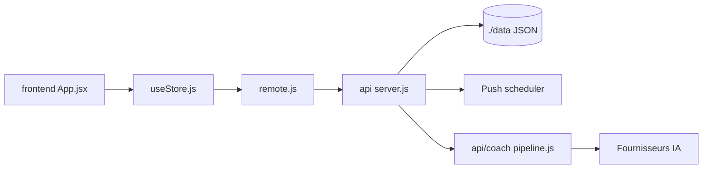

# DuarteSantos8/openGym

> Suivi de musculation et de poids auto-hébergé, avec connexion par passkey, pour sportifs qui veulent leurs données chez eux.

## Le problème
Les applis de musculation gardent tes données derrière un compte distant, poussent l'abonnement et disparaissent avec la start-up.

## Ce que ça fait vraiment
PWA React avec plan hebdomadaire sur 1 324 exercices, séances guidées, minuteur, progression par règle, 1RM estimé, statistiques et cartes musculaires. L'API Node sans framework stocke en fichiers JSON sous `./data`, authentifie par passkeys WebAuthn et envoie des notifications push. Import depuis FitNotes, Strong et Hevy. Un coach IA optionnel et un serveur MCP en lecture seule existent.

## Comment c'est branché


## Essayer
```bash
git clone https://github.com/DuarteSantos8/openGym
cd openGym
cp .env.example .env
docker compose pull
docker compose up -d
```

## Coût et pièges
Gratuit. Le coach IA, optionnel, utilise ta propre clé (Anthropic, OpenAI, Gemini ou endpoint compatible). Les médias d'exercices (~140 Mo) sont téléchargés depuis un dépôt tiers, et leurs droits sont contestés d'après le README.

## Ce que ce n'est pas
Pas une appli mobile sur l'App Store : APK à charger soi-même, pas de téléchargement iOS. AGPL-3.0 : obligations en cas d'hébergement modifié.

## Alternatives
Hevy, Strong ou FitNotes, cités comme sources d'import.

## Pour toi
À ignorer : suivi sportif sans lien avec un profil data/IA/MLOps, malgré une conception soignée.
