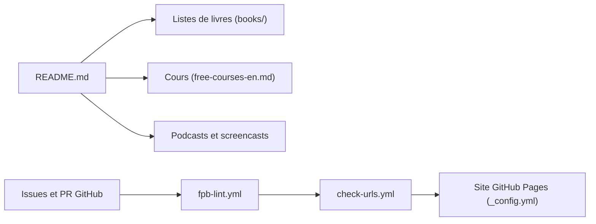

# EbookFoundation/free-programming-books

> Liste collaborative de livres, cours, podcasts et cheat sheets gratuits, classés par langue, pour apprenants.

## Le problème
Les bonnes ressources gratuites pour apprendre à programmer sont dispersées sur le web, en dizaines de langues, et vieillissent vite. Sans liste tenue à jour, on tombe sur des liens morts ou du contenu payant déguisé.

## Ce que ça fait vraiment
Ce sont des fichiers Markdown de liens, rangés par type (livres, cours, podcasts/screencasts, cheat sheets, problem sets) puis par langue. Les livres en anglais ont deux index : par langage et par sujet. Rien ne s'exécute : le dépôt ne contient ni base ni application. Trois workflows GitHub Actions vérifient les URL, le format et le sens d'écriture (RTL/LTR) des contributions.

## Comment c'est branché

## Essayer
Aucune commande documentée dans le README : la liste se consulte sur le dépôt ou sur le site statique, et une recherche dédiée existe à l'adresse ebookfoundation.github.io/free-programming-books-search/.

## Coût et pièges
Gratuit, rien à créer. Les liens pointent vers des sites tiers dont le contenu n'est pas garanti par le dépôt ; la moitié du contenu est dans des langues autres que l'anglais.

## Ce que ce n'est pas
Ce n'est pas un parcours pédagogique : aucun ordre de lecture, aucune évaluation de qualité au-delà de la curation. La recherche est un service séparé, hébergé hors de ce dépôt.

## Alternatives
Aucune alternative nommée dans le README.

## Pour toi
À surveiller comme carnet d'adresses ponctuel (livres et cours gratuits) : utile pour combler une lacune, mais sans ligne dédiée data/IA, donc pas un outil de travail quotidien.

