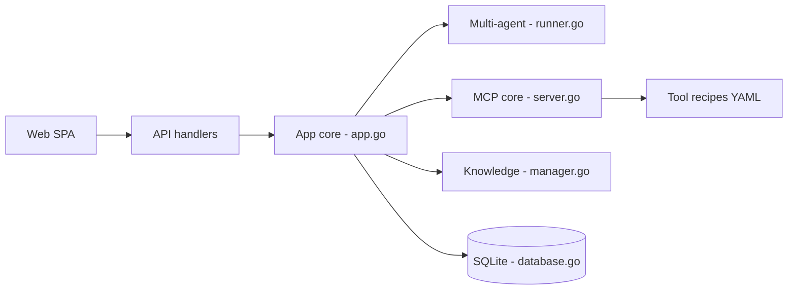

# Ed1s0nZ/CyberStrikeAI

> Plateforme Go pilotée par LLM qui orchestre des outils de test d'intrusion, pour équipes de sécurité autorisées.

## Le problème
Un test d'intrusion enchaîne des dizaines d'outils en ligne de commande, dont il faut piloter les sorties, tracer les décisions et consigner les constats à la main.

## Ce que ça fait vraiment
- Un serveur Go avec interface web : une demande en langage naturel devient une suite d'appels d'outils (recettes YAML, plus de 100), exécutés via une couche MCP.
- Modes mono-agent et multi-agents (Deep, Plan-Execute, Supervisor), rôles, skills et workflows en graphe, avec validation humaine et journal d'audit.
- Stocke conversations, vulnérabilités, actifs et chaînes d'attaque dans SQLite ; base de connaissances avec recherche vectorielle.
- Modules à double usage (gestion de WebShell, C2 intégré), réservés aux systèmes que l'on possède ou pour lesquels on a une autorisation écrite.

## Comment c'est branché


## Essayer
```bash
git clone https://github.com/Ed1s0nZ/CyberStrikeAI.git
cd CyberStrikeAI
chmod +x run.sh && ./run.sh
# ou : ./run.sh --http
# puis configurer un canal IA dans Paramètres système (clé d'API, URL, modèle)
```

## Coût et pièges
Il faut Go 1.25+, Python 3.10+ et une clé d'API d'un fournisseur compatible OpenAI, facturée à ta charge. Les outils de sécurité sont à installer séparément ; le mot de passe admin initial s'affiche une seule fois au premier démarrage.

## Ce que ce n'est pas
Ce n'est pas un outil à lancer sur des cibles quelconques : l'usage suppose une autorisation explicite, sous peine de poursuites. La licence n'est pas déclarée dans le catalogue : réutilisation et redistribution incertaines. Il faut durcir la configuration avant toute exposition hors localhost.

## Alternatives
- Le plugin Burp Suite livré dans le dépôt, si tu veux rester dans ton proxy d'interception habituel.
- Les outils unitaires cités (nmap, nuclei, sqlmap, metasploit) utilisés directement, si tu n'as pas besoin de la couche agent.

## Pour toi
À surveiller : l'orchestration MCP, RBAC et audit des appels d'outils est instructive pour un profil IA/MLOps, mais la licence non déclarée, le mainteneur unique et le périmètre offensif en font un outil de spécialistes sécurité.
