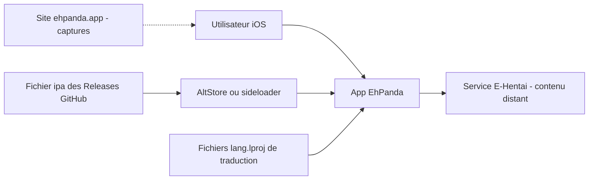

# EhPanda-Team/EhPanda

> **Unofficial iOS client for an image-gallery site, sideloaded outside the App Store.**

## The problem

E-Hentai has no official iOS client, and its content cannot be shipped through the App Store.
Without a third-party app, readers are left with the mobile browser, no dedicated reader and
no local gallery handling. The README never states the problem itself — it follows from what
the project is.

## What it actually does

The README is short and lists no features. What it does document: an iOS / iPadOS app written
in Swift, presented as an unofficial E-Hentai client, whose displayed content comes entirely
from that site and is user-generated. It ships as an `.ipa` file through GitHub Releases,
outside the App Store. It is localised into German, Korean, Japanese, Traditional and
Simplified Chinese, and the project openly asks for translation contributions, both for the
app strings (`{lang}.lproj`) and for the README. A companion site, ehpanda.app, hosts the
screenshots. No internal architecture, API or data format is described.

## How it is wired



The diagram is inferred from the README alone, not from the code. Two separate paths: the
install path, where the `.ipa` published in Releases is loaded onto the device by a
sideloading tool such as AltStore; and the usage path, where the app queries the remote
E-Hentai service for its content. The `{lang}.lproj` files under `EhPanda/App` carry the UI
translations. The README says nothing about networking, caching or local storage.

## Trying it

```
# No command is documented in the README.
# 1. Get the ipa file from https://github.com/EhPanda-Team/EhPanda/releases
# 2. Install it on the device with a sideloading tool, for example AltStore (https://altstore.io)
```

There is no build step, no command-line install and no compilation instruction in the README:
only those two steps, written in prose.

## Cost and traps

The code is free and MIT-licensed, but actual use has conditions. It requires iOS or iPadOS
26.0 or later — a hard cut-off that rules out older devices. Installation goes through
sideloading, with the usual constraints (third-party tool, periodic re-signing depending on
the Apple account used). Above all, the app is worth only as much as the E-Hentai service it
fully depends on: if that changes or becomes unreachable, nothing is left. The README itself
warns that the content is user-generated and that **users access it at their own risk** —
the legal and content questions are not handled by the project.

## What it is not

It is not an official or affiliated E-Hentai app, and it is not a service: without the remote
site there is nothing left. It is not a reusable library or SDK either — the README offers no
API or embeddable component. Finally it is not installable from the App Store, and the README
documents neither building from source nor the app's own features.

## Alternatives

No comparable alternative in the catalogue. The suggested neighbours all belong to the Swift
ecosystem but serve entirely different purposes: XcodesOrg/XcodesApp manages Xcode installs,
ming1016/SwiftPamphletApp is a Swift learning notebook, and 0x1-company/ios-monorepo is an
app monorepo. None is a gallery client, and the README names no competing project.

## For you

Nothing here for a data / AI / MLOps profile: no pipeline, no model, no usable dataset, and a
total dependency on a third-party service with sensitive content. The only residual angle
would be reading the Swift code as a multilingual iOS app sample — which the README does not
document either. Skip it.
