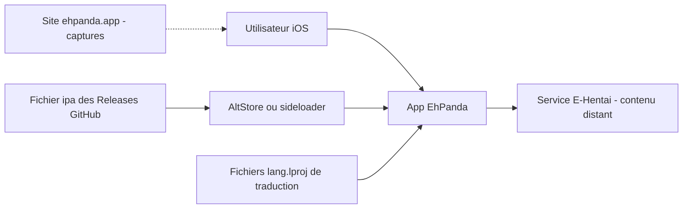

# EhPanda-Team/EhPanda

> **Client iOS non officiel d'un site de galeries, installé hors App Store, pour lecteurs sur iPhone.**

## Le problème

Le site E-Hentai n'a pas de client iOS officiel, et son contenu n'est pas distribuable via
l'App Store. Sans une application tierce, il faut passer par le navigateur mobile, sans
lecteur dédié ni gestion locale des galeries. Le README ne formule pas le problème
explicitement — il se déduit de la nature du projet.

## Ce que ça fait vraiment

Le README est court et ne détaille pas les fonctionnalités. Ce qu'il documente :
c'est une application iOS / iPadOS écrite en Swift, présentée comme un client non officiel
d'E-Hentai, dont le contenu affiché provient entièrement de ce site et est produit par ses
utilisateurs. L'application est distribuée sous forme de fichier `.ipa` via les Releases
GitHub, hors App Store. Elle est traduite en plusieurs langues (allemand, coréen, japonais,
chinois traditionnel et simplifié), et le projet appelle explicitement à contribuer aux
traductions, tant des chaînes de l'app (`{lang}.lproj`) que du README. Un site
d'accompagnement, ehpanda.app, héberge les captures d'écran. Aucune architecture interne,
aucune API, aucun format de données n'est décrit dans le README.

## Comment c'est branché



Le schéma est déduit du seul README, pas du code. Deux circuits distincts : celui de
l'installation, où l'`.ipa` publié dans les Releases est chargé sur l'appareil par un outil
de sideloading type AltStore ; et celui de l'usage, où l'application interroge le service
E-Hentai distant pour afficher son contenu. Les fichiers `{lang}.lproj` du dossier
`EhPanda/App` portent les traductions de l'interface. Le README ne dit rien de la couche
réseau, du cache, ni du stockage local.

## Essayer

```
# Aucune commande n'est documentée dans le README.
# 1. Récupérer le fichier ipa depuis https://github.com/EhPanda-Team/EhPanda/releases
# 2. L'installer sur l'appareil avec un outil de sideloading, par exemple AltStore (https://altstore.io)
```

Il n'y a ni build, ni installation en ligne de commande, ni instruction de compilation dans
le README : seulement ces deux étapes rédigées en prose.

## Coût et pièges

Le code est gratuit et sous licence MIT, mais l'usage réel a plusieurs conditions. Il faut
iOS ou iPadOS 26.0 ou plus récent — un prérequis sévère qui exclut les appareils anciens.
L'installation passe obligatoirement par du sideloading, avec les contraintes associées
(outil tiers, resignature périodique selon le type de compte Apple utilisé). Surtout,
l'application ne vaut que par le service E-Hentai dont elle dépend entièrement : s'il change
ou devient inaccessible, l'app n'a plus de matière. Le README avertit lui-même que le contenu
est généré par les utilisateurs et que **son accès se fait aux risques de l'utilisateur** —
la question légale et celle du contenu ne sont pas traitées par le projet.

## Ce que ce n'est pas

Ce n'est pas une application officielle ni affiliée à E-Hentai, et ce n'est pas un service :
sans le site distant, il ne reste rien. Ce n'est pas non plus une bibliothèque ou un SDK
réutilisable — rien dans le README ne propose d'API ou de composant à intégrer. Enfin ce
n'est pas installable depuis l'App Store, et le README ne documente ni la compilation depuis
les sources, ni les fonctionnalités de l'application elle-même.

## Alternatives

Aucune alternative comparable dans le catalogue. Les voisins proposés relèvent tous de
l'écosystème Swift mais d'un tout autre usage : XcodesOrg/XcodesApp gère les installations
d'Xcode, ming1016/SwiftPamphletApp est un carnet d'apprentissage Swift, et
0x1-company/ios-monorepo est un monorepo d'applications. Aucun n'est un client de galeries,
et le README ne cite aucun projet concurrent.

## Pour toi

Aucun intérêt pour un profil data / IA / MLOps : pas de pipeline, pas de modèle, pas de
donnée exploitable, et une dépendance totale à un service tiers au contenu sensible. Le seul
angle résiduel serait la lecture du code Swift comme exemple d'app iOS multilingue — ce que
le README ne documente d'ailleurs pas. À passer.
