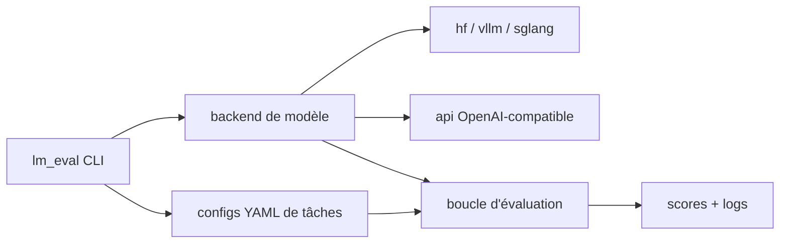

# EleutherAI/lm-evaluation-harness

> Cadre unifié pour évaluer des modèles de langage génératifs sur des dizaines de benchmarks.

## Le problème
Chaque papier évalue avec ses propres prompts et son propre découpage, donc deux scores publiés
sur la même tâche ne sont pas comparables.

## Ce que ça fait vraiment
Plus de 60 benchmarks académiques standard, avec des centaines de sous-tâches. Les tâches se
définissent par configuration YAML avec prompts Jinja2, post-traitement de sortie, extraction de
réponse et paramétrage du few-shot. De nombreux backends : transformers (avec quantification),
vLLM, SGLang, NeMo, Megatron-LM, OpenVINO, ONNX Runtime et ONNX Runtime GenAI, llama.cpp, APIs
commerciales, adaptateurs LoRA via PEFT, et vecteurs de steering (`--model steered`).

## Comment c'est branché


## Essayer
```bash
git clone --depth 1 https://github.com/EleutherAI/lm-evaluation-harness
cd lm-evaluation-harness
pip install -e .
pip install "lm_eval[hf,vllm,api]"
lm-eval ls tasks
lm_eval --model hf --model_args pretrained=EleutherAI/gpt-j-6B --tasks hellaswag --device cuda:0 --batch_size 8
```

## Coût et pièges
Gratuit, mais les backends de modèles s'installent séparément par extras — l'installation de base
n'évalue rien. GPU CUDA attendu pour l'essentiel. Les modèles GGUF sans tokenizer séparé peuvent
prendre des heures ou se figer à la reconstruction du tokenizer. Pas d'évaluation multi-nœuds
native. `data_parallel_size>1` en vLLM exige `pip install ray`.

## Ce que ce n'est pas
Ce n'est pas un classement en ligne : c'est le moteur derrière l'Open LLM Leaderboard de Hugging
Face, pas le tableau lui-même. Les sorties vLLM diffèrent parfois de Hugging Face, qui fait
référence. `loglikelihood_rolling` (perplexité, wikitext) n'est pas implémenté pour le type `gguf`.

## Alternatives
Aucune alternative externe n'est nommée ; le README renvoie à l'intégration GPT-NeoX pour les
scénarios multi-machines.

## Pour toi
C'est l'outil de référence dès que tu dois chiffrer une régression de qualité après fine-tuning ou
quantification — à garder même si tu n'en utilises que trois tâches.
