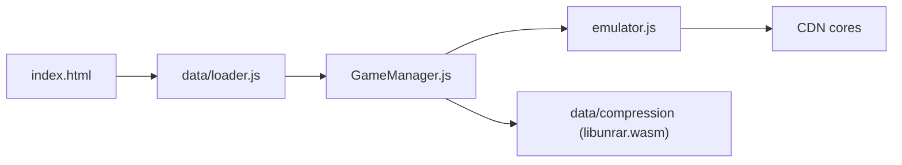

# EmulatorJS/EmulatorJS

> Bibliothèque JavaScript qui fait tourner des émulateurs de consoles dans le navigateur, pour intégrateurs web.

## Le problème
Proposer des jeux rétro dans une page web oblige à assembler émulateurs, décompression, manettes et localisation soi-même.

## Ce que ça fait vraiment
Un `loader.js` initialise le moteur ; `GameManager.js` et `emulator.js` pilotent le cœur d'émulation, avec gestion manette, shaders et stockage. Les archives (7z, zip, rar via `libunrar.wasm`) sont décompressées côté client. Les cœurs viennent d'un CDN public, en versions stable, latest ou nightly.

## Comment c'est branché


## Essayer
```bash
npm i
npm run start
# puis http://localhost:8080/
```

## Coût et pièges
Gratuit. La version « nightly » n'est pas recommandée en production, « latest » est souvent plus instable. Minifier les scripts avant déploiement.

## Ce que ce n'est pas
Pas un site autonome ni un conteneur Docker : c'est une bibliothèque à intégrer. Aucune ROM n'est fournie. GPL-3.0 : contrainte copyleft sur les dérivés.

## Alternatives
- Aucune alternative citée dans le README.

## Pour toi
À ignorer : hors du périmètre data/IA/MLOps ; seul un projet web de jeux rétro y trouverait un intérêt.

