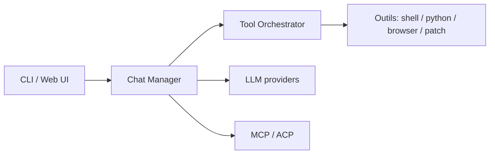

# ErikBjare/gptme

> Agent IA en terminal, indépendant du fournisseur, pour le code et le travail de connaissance.

## Le problème
Les agents de code sont liés à un fournisseur ou un éditeur ; on veut le même agent en SSH, en CI ou sur un serveur sans interface.

## Ce que ça fait vraiment
CLI avec outils : shell, Python, patch, navigateur (Playwright), vision, tmux, GitHub, sous-agents, RAG. Il fonctionne avec Anthropic, OpenAI, Google, xAI, DeepSeek, OpenRouter ou llama.cpp en local. Système de plugins, compétences et leçons injectées selon le contexte ; client et serveur MCP ; ACP pour Zed et JetBrains ; interface web et TUI ; agents autonomes persistants (modèle gptme-agent-template, service systemd).

## Comment c'est branché


## Essayer
```bash
pipx install gptme
gptme
gptme -n 'run the test suite and fix any failing tests'
```

## Coût et pièges
Au moins un accès fournisseur (clé d'API ou abonnement) ; jetons à ta charge, sauf modèles locaux. Le mode `-y` ou `-n` exécute des outils sans confirmation : à réserver aux environnements isolés.

## Ce que ce n'est pas
Pas un IDE. Le tableau de comparaison du README avec Claude Code, Cursor et Warp est rédigé par l'auteur. Les enregistrements de démonstration datent de 2023.

## Alternatives
Claude Code, Codex, Cursor et Warp (comparés dans le README).

## Pour toi
À adopter pour un agent CLI multi-fournisseur, scriptable en CI et extensible, avec un projet actif depuis 2023.
