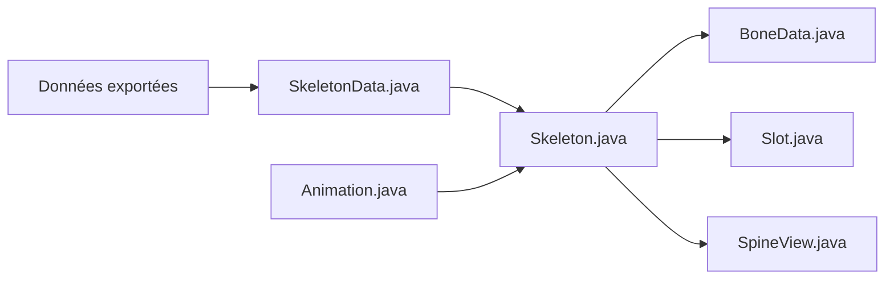

# EsotericSoftware/spine-runtimes

> Bibliothèques pour lire et jouer les animations squelettiques 2D du logiciel Spine dans des moteurs de jeu.

## Le problème
Les animations créées dans l'éditeur Spine ne s'affichent pas d'elles-mêmes dans un jeu ; il faut un moteur d'exécution par plateforme.

## Ce que ça fait vraiment
Runtimes dans plusieurs langages et moteurs (LibGDX, C++, C#, TypeScript, Android, iOS, Godot). Le principe : charger les données exportées, avancer l'état d'animation, mettre à jour la pose du squelette (os, slots, pièces jointes, skins, timelines), puis dessiner via la plateforme. La documentation propre à chaque runtime est dans son dossier.

## Comment c'est branché


## Essayer
```bash
# aucune commande dans le README : voir le README.md de chaque dossier de runtime
```

## Coût et pièges
Évaluation gratuite. Pour distribuer un logiciel qui contient les runtimes, une licence Spine est nécessaire, et les utilisateurs finaux doivent avoir la leur dans certains cas. GitHub n'identifie pas la licence : à vérifier. Conseil du README : figer la version de l'éditeur Spine en même temps que celle des runtimes.

## Ce que ce n'est pas
Pas libre au sens open source : les conditions d'usage sont celles du contrat Spine. Ce n'est pas l'éditeur d'animation.

## Alternatives
Aucune alternative nommée dans le README.

## Pour toi
Ignorer : outil d'animation de jeu sous licence commerciale, sans lien avec data/IA/MLOps.

