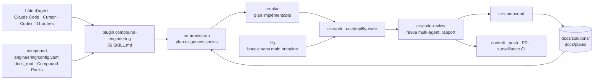

# EveryInc/compound-engineering-plugin

> **Thirty-six skills that impose an idea-plan-build-review-remember loop on a coding agent.**

## The problem

Every coding-agent session starts from nothing. Constraints discovered last week, traps hidden
in one file, house rules — all relearned or lost. Work piles up as debt instead of leverage,
and each next change costs more than the last.

## What it actually does

Compound Engineering is a plugin of 36 skills for AI coding agents. It ships no runtime of its
own; what it provides is structured prompts and file conventions:

- **A six-step loop**, one skill each: `/ce-brainstorm` (Q&A that writes a requirements-only
  plan), `/ce-plan` (enrich it until implementable), `/ce-work`, `/ce-simplify-code`,
  `/ce-code-review` (report-only multi-agent review; applying fixes locally stays explicit),
  and `/ce-compound`.
- **`/ce-compound` writes the learning into `docs/solutions/`**, which the next
  `/ce-brainstorm` and `/ce-plan` read as grounding. That is the whole memory mechanism, and
  it lives in repo files.
- **`/lfg`** runs the pipeline hands-off: it routes to a verified work source (a plan, or a
  `ce-debug` fix for a bug), works it, simplifies, applies review fixes, runs browser tests,
  commits; with a git remote it pushes, opens a PR and watches CI through a bounded repair
  loop. It does not merge unless granted, and it can finish with leftovers.
- **The rest of the catalog** covers git (`ce-commit-push-pr`, `ce-babysit-pr`, `ce-worktree`),
  on-demand needs (`ce-debug`, `ce-explain`, `ce-pov`, `ce-bakeoff`), testing
  (`ce-test-browser`, `ce-test-xcode`) and utilities (`ce-setup`, `wtf`, `ce-noslop`).
- **Compound Packs** (labelled experimental) let an org declare folders of prescriptive rules —
  local or ref-pinned git repos — that planning grounds in and review enforces, each use cited
  back to the rule file.
- **Fourteen agent hosts** are supported: Claude Code, Cursor, Codex (app and CLI), Kimi Code,
  Cline, Grok, Devin, Copilot, Factory Droid, Qwen Code, OpenCode, Pi, omp, Antigravity CLI.
  Invocation syntax differs per host (`/name`, `$name`, `/skill:<name>`).

## How it is wired

No code-derived diagram exists for this repo; the graph below follows the loop the README
describes and its file artifacts (`docs/solutions/`, `docs/plans/`,
`.compound-engineering/config.yaml`).



## Trying it

The README gives one command per host; these are Claude Code, Cursor and Codex CLI, followed
by getting started inside a project.

```bash
# Claude Code (dans la session)
/plugin marketplace add EveryInc/compound-engineering-plugin
/plugin install compound-engineering

# Cursor (dans le chat Agent)
/add-plugin compound-engineering

# Codex CLI (shell)
codex plugin marketplace add EveryInc/compound-engineering-plugin
codex plugin add compound-engineering@compound-engineering-plugin

# puis, dans n'importe quel projet
/ce-setup
/ce-brainstorm make background job retries safer
/ce-plan
/ce-work
/ce-simplify-code
/ce-code-review
/ce-compound
```

## Cost and gotchas

- **The plugin is free (MIT); the agent is not.** It executes nothing on its own — you need a
  host (Claude Code, Cursor, Codex, Copilot…) with its subscription or token billing. The
  README puts no number on it, but a six-skill loop plus a multi-agent review burns
  considerably more tokens than a single prompt.
- **A third-party account may be required per host**: the README notes Grok Bot has no login of
  its own and rides on your Cursor account.
- **Upgrading is a documented trap**: refresh the cached marketplace *before* updating;
  `/plugin update` alone keeps you on the old version (see `docs/install/upgrading.md`).
- **Artifacts land in the repo**: skills write to `docs/solutions/` and `docs/plans/` by
  default; if `docs/` is tracked content, relocate the artifact root via the `docs_root`
  setting.
- **Uneven host support**: on Devin some skills declare Claude-style `allowed-tools` names
  (e.g. `Bash`) that Devin does not map, so those actions prompt for permission instead of
  running. Compound Packs are experimental. Under omp, hidden or manual-only skills require the
  native `/skill:<name>` form.

## What it is not

- **Not an agent and not a model.** There is no execution code — these are `SKILL.md` files
  loaded by an existing host. Without a host the repo does nothing.
- **Not automatic shared memory.** Compounding rests on markdown files written into the repo by
  `/ce-compound` and reread by later skills: no vector store, no service, and nothing crosses
  repository boundaries unless you declare a pack.
- **Not neutral.** The README says so: an opinionated project steered by two Every maintainers,
  and not every contribution will be accepted. You adopt a complete working method, not a
  toolbox to cherry-pick without thinking.

## Alternatives

| | When to prefer it |
|---|---|
| **addyosmani/agent-skills** | Another collection of coding-agent skills. Prefer it to pick up independent skills one at a time, when you do not want an end-to-end workflow imposed on you. |
| **ComposioHQ/awesome-claude-skills** | An annotated list, not an installable plugin: useful to survey what skills exist — including this one — before deciding what to install. |
| **bytedance/deer-flow, langgenius/dify** | Off-topic here: these are platforms for orchestrating application agents, not extensions of the agent that writes your code. The catalog pairing comes from the word "agent", not from the use case. |

## For you

If your data/AI work already runs through a coding agent, this is one of the few setups that
tackles the real weak point — context lost between sessions — with a legible mechanism
(markdown files in the repo) rather than a black box. Adopt it starting with `/ce-brainstorm`,
`/ce-plan` and `/ce-compound` alone, before considering `/lfg` and its token bill; the rest of
the catalog can wait until the short loop has proved itself.
